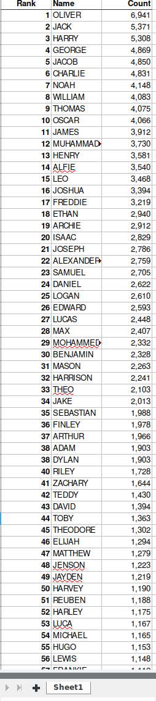
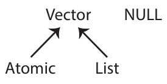
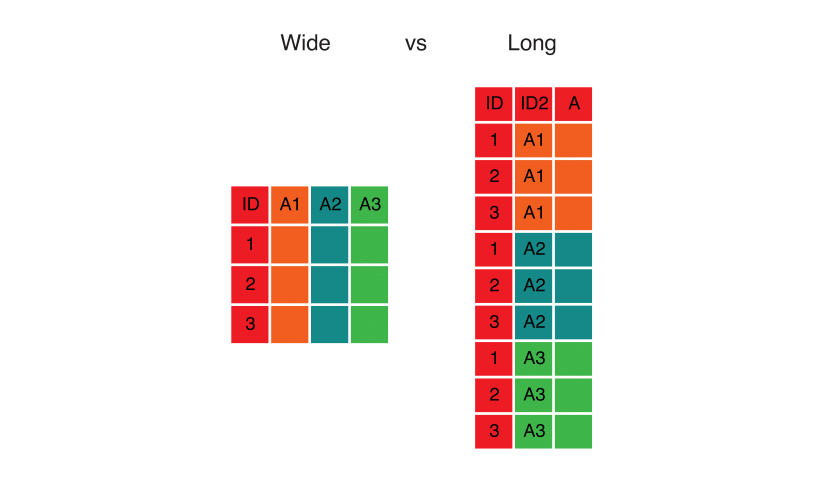

---
output:
  word_document: default
  html_document: default
---


# R Data Wrangling

**Topics**

* Loading Excel worksheets
* Iterating over files
* Writing your own functions
* Filtering with regular expressions (regex)
* Reshaping data


## Setup 

### Class Structure

* Informal --- Ask questions at any time. Really!
* Collaboration is encouraged - please spend a minute introducing yourself to your neighbors!

### Prerequisites

This is an intermediate / advanced R course:

* Assumes intermediate knowledge of R
* Relatively fast-paced

### Launch an R session

Start RStudio and create a new project:

* On Windows click the start button and search for RStudio. On Mac
    RStudio will be in your applications folder.
* In Rstudio go to `File -> New Project`.
* Choose `Existing Directory` and browse to the workshop materials directory on your desktop.
* Choose `File -> Open File` and select the file with the word "BLANK" in the name.

### Packages

You should have already installed the `tidyverse` and `rmarkdown`
packages onto your computer before the workshop 
--- see [R Installation](./Rinstall.html). 
Now let's load these packages into the search path of our R session.

```{r}
library(tidyverse)
library(rmarkdown)
library(readxl) # installed with tidyverse, but not loaded into R session
```

### Workshop Outline

**Example data**

The UK [Office for National Statistics](https://www.ons.gov.uk) provides yearly
    data on the most popular boys names going back to 1996. The data is provided
    separately for boys and girls and is stored in Excel spreadsheets.

**Overall Goal** 

Our mission is to extract and graph the **top 100** boys names in England and Wales for every year since 1996. 
 


**Exercise 0: Problems with the data**

There are several things that make our goal challenging. Let's take a look at the data:

1.  Locate the files named `1996boys_tcm77-254026.xlsx` and 
    `2015boysnamesfinal.xlsx` and open them separately in a 
    spreadsheet program. 

    (If you don't have a spreadsheet program installed on
    your computer you can download one from
    https://www.libreoffice.org/download/download/). 

    What issues can you identify that might make working
    with these data difficult?

    In what ways is the format different between the two files?


**Steps to accomplish this goal:**

0.  **Explore example data to highlight problems (see Exercise 0)**

1.  **Reading data from multiple Excel worksheets into R data frames**
    + list Excel file names in a character vector
    + read Excel sheetnames into a list of character vectors
    + read Excel data for "Table 1" only into a list of data frames

2.  **Clean up data within each R data frame**
    + sort and merge columns within each data frame inside the list
    + drop missing values from each data frame
    + reshape format from wide to long

3.  **Organize the data into one large data frame and store it**
    + create a year column within each data frame in the list
    + append all the data frames in the list into one large data frame

NOTE: please make sure you close the Excel files before continuing with the
workshop, otherwise you may encounter issues with file paths when reading
the data into R.


## Working with Excel worksheets

As you can see, the data is in quite a messy state. Note that this is
not a contrived example; this is exactly the way the data came to us
from the UK government website! Let's start cleaning and organizing
it. 

Each Excel file contains a worksheet with the boy names data we want.
Each file also contains additional supplemental worksheets that we are
not currently interested in. As noted above, the worksheet of interest
differs from year to year, but always has "Table 1" in the sheet name.

The first step is to get a character vector of file names.

```{r}

```

Now that we've told R the names of the data files, we can start working
with them. For example, the first file is

```{r}

```

and we can use the `excel_sheets()` function from the `readxl` package
within `tidyverse` to list the worksheet names from this file.

```{r}

```

### Iterating with `map()`

Now that we know how to retrieve the names of the worksheets in an
Excel file, we could start writing code to extract the sheet names from
each file, e.g.,

```{r}


## ...


```

This is not a terrible idea for a small number of files, but it is
more convenient to let R do the iteration for us. We could use a `for loop`,
or `sapply()`, but the `map()` family of functions from the `purrr`
package within `tidyverse` gives us a more consistent alternative, 
so we'll use that.

```{r}
# map(object to iterate over, function that does task within each iteration)


```

### Filtering strings using regex

To extract the correct worksheet names we need a way to extract
strings containing "Table 1". 

Base R provides some string manipulation capabilities 
(see `?regex`, `?sub` and `?grep`), but we will use the
`stringr` package within `tidyverse` because it is more
user-friendly. `stringr` provides functions to:

1.  detect 
2.  locate
3.  extract
4.  match
5.  replace
6.  combine
7.  split   

strings. Here we want to detect the pattern "Table 1", and only
return elements with this pattern. We can do that using the
`str_subset()` function: 

1.  The first argument to `str_subset()` is character vector we want to search in. 
2.  The second argument is a *regular expression* matching the pattern we want to retain.

If you are not familiar with regular expressions (regex), 
<http://www.regexr.com/> is a good place to start. Regex is essentially
just a programmatic way of doing operations like "find" or "find and replace"
in MS Word or Excel.

Now that we know how to filter character vectors using `str_subset()` we can
identify the correct sheet in a particular Excel file. For example,

```{r}
# str_subset(character_vector, regex_pattern)

# nesting functions


# piping functions

```

### Writing your own functions

The next step is to retrieve worksheet names and subset them.

The `map*` functions are useful when you want to apply a function to a
vector of inputs and obtain the return values for each input. This 
is very convenient when a function already exists that does exactly what you
want. In the examples above we mapped the `excel_sheets()` function to
the elements of a character vector containing file names. 

However, there is no function that both:

1.  Retrieves worksheet names, and 
2.  Subsets the names

So, we will have to write one. Fortunately, writing functions in R is easy. 
Functions require 3 elements:

1.  A **name**
2.  One or more **arguments**
3.  A **body** containing computations


Anatomy of a function:

```{r, eval=FALSE}
function_name <- function(arg1, arg2, ....) {
  
    body of function # where stuff happens 

    return( results ) 
}
```

Simple examples:

```{r}


```

Examples using the Excel data:

```{r}


# the goal is generalization 


```

Now we can map this new function over our vector of file names.

```{r}
# map(object to iterate over, 
#     function that does task within each iteration, 
#     arguments to previous function)
 
# list object
# function
# argument to previous function
```

## Reading Excel data files

Now that we know the correct worksheet from each file, we can actually
read those data into R. We can do that using the `read_excel()` function.

We'll start by reading the data from the first file, just to check
that it works. Recall that the actual data starts on row 7, so we want
to skip the first 6 rows. We can use the `glimpse()` function from
the `dplyr` package within `tidyverse` to view the output.

```{r}


```

Note that R has added a suffix to each column name `...1`, `...2`,
`...3`, etc. because duplicate names are not allowed, so the suffix serves
 to disambiguate. The trailing number represents the index of the column.


### Exercise 1

  1. Write a function called `read_boys_names` that takes a file name as an argument 
     and reads the worksheet containing "Table 1" from that file. Don't forget
     to skip the first 6 rows.
```{r}


```

  2. Test your function by using it to read *one* of the boys names
     Excel files.
```{r}


```

  3. Use the `map()` function to create a list of data frames called `boysNames`          
     from all the Excel files, using the function you wrote in step 1.
```{r}


```


## Data cleanup

Now that we've read in the data, we can see that there are some
problems we need to fix. Specifically, we need to:

1. fix column names
2. get rid of blank row and the top and the notes at the bottom
3. get rid of extraneous "changes in rank" columns if they exist
4. transform the side-by-side tables layout to a single table.

```{r}
# Rank 1:50 --- Names / Counts are in columns 2 and 3 
# Rank 51:100 --- Names / Counts are in columns 6 and 7

# Rank 1:50 --- Names / Counts are in columns 2 and 3 
# Rank 51:100 --- Names / Counts are in columns 7 and 8

# Rank 1:50 --- Names / Counts are in columns 2 and 3 
# Rank 51:100 --- Names / Counts are in columns 8 and 9


```

In short, we want to go from this:


to this:



There are many ways to do this kind of data manipulation in R. We're
going to use the `dplyr` and `tidyr` packages from within `tidyverse`
to make our lives easier.


### Selecting columns

Next we want to retain just the `Name...2`, `Name...6`, `Count...3` and `Count...7` columns. 
We can do that using the `select()` function:

```{r}


```

### Data types and structures

We've now encountered several different data types and data structures. Let's take a step back and survey the options available in R.

**Data structures:**

In R, the most foundational data structure is the **vector**. Vectors are *containers* that
can hold a *collection* of values. Vectors come in two basic forms:

1. **atomic**: only hold elements of the same type; they are **homogeneous**. The `c()` function can be used to create atomic vectors.
2. **list**: can hold elements of different types; they are **heterogeneous**. The `list()` function can be used to create list vectors.

`NULL` is closely related to vectors and often serves the role of a zero length vector. 



From these two basic forms, the following six structures are derived:

| Type           | Elements       | Description                                                                                                       |
|:---------------|:---------------|:------------------------------------------------------------------------------------------------------------------|
| atomic vector  | homogeneous    | contains elements of the same **type**, one of: character, integer, double, logical                   |
| array          | homogeneous    | an atomic vector with attributes giving dimensions (1, 2, or >2)                                                  |
| matrix         | homogeneous    | an array with 2 dimensions                                                                                         |
| factor         | homogeneous    | an atomic integer vector containing only predefined values, storing categorical data                              |
| list           | heterogeneous  | a container whose elements can encompass any mixture of data types        |
| data.frame     | heterogeneous  | a rectangular list with elements (columns) containing atomic vectors of equal length                              |

Each vector can have **attributes**, which are a named list of metadata that can include the vector's **dimensions** and its **class**. The latter is a property assigned to an object that determines how **generic functions** operate with it, and thus which **methods** are available for it. The class of an object can be queried using the `class()` function. You can learn more details about R data structures here: <https://adv-r.hadley.nz/vectors-chap.html>


**Data types:**

There are four primary types of atomic vectors. Collectively, integer and double vectors are known as numeric vectors. You can query the **type** of an object using the `typeof()` function.


| Type                    | Description                                          |
|:------------------------|:-----------------------------------------------------|
| character               | "a", "swc"                                           |
| integer                 | 2L (the L tells R to store this as an integer)       |
| double (floating point) | 2, 15.5                                              |
| logical                 | TRUE, FALSE                                          |


**Coercion:**

If heterogeneous elements are stored in an atomic vector, R will **coerce** the vector to the simplest type required to store all the information. The order of coercion is roughly: logical -> integer -> double -> character -> list. For example:

```{r}
x <- c(1.5, 2.7, 3.9)
typeof(x)

y <- c(1.5, 2.7, 3.9, "a")
typeof(y)
```


### List indexing

Now that we know about data structures more generally, let's focus on the *list* structure we created for `boysNames`. 
Why are we using **double brackets** `[[` to index this list object, instead of the single brackets `[` we used to index atomic vectors?


```{r}
# various data structures
numbers <- 1:10
letters <- LETTERS[1:4]
dat <- head(mtcars)
x <- 237L

# combine in a list
mylist <- list(numbers, letters, dat, x)

# indexing the list
mylist[2]
class(mylist[2]) # a list

mylist[[2]]
class(mylist[[2]]) # a character vector
```


### Dropping missing values

Next we want to remove blank rows and rows used for notes. An easy way
to do that is to use `drop_na()` from the `tidyr` package within `tidyverse`
to remove rows with missing values.

```{r}


```


### Exercise 2

  1. Write a function called `namecount` that takes a data frame as an 
     argument and returns a modified version, which keeps only columns that
     include the strings `Name` and `Count` in the column names.
     HINT: see the `?matches` function. 
     
```{r}


```

2.  Test your function on the first data frame in the list of boys names data.

```{r}


```

3.  Use the `map()` function to each data frame in the list of boys names data.

```{r}


```


### Reshaping from wide to long

Our final task is to re-arrange the data so that it is all in a single
table instead of in two side-by-side tables. For many similar tasks
the `gather()` function in the `tidyr` package is useful, but in this
case we will be better off using a combination of `select()` and
`bind_rows()`. Here's the logic behind this step:





Here’s the code that implements the transformation:

```{r}


```


### Exercise 3

**Cleanup all the data**

In the previous examples we learned how to drop empty rows with
`drop_na()`, select only relevant columns with `select()`, and re-arrange
our data with `select()` and `bind_rows()`. In each case we applied the
changes only to the first element of our `boysNames` list.

NOTE: some Excel files include extra blank columns between the first and second 
set of `Name` and `Count` columns, resulting in different numeric suffixes
for the second set of columns. You will need to use a regular expression
to match each of these different column names. HINT: see the `?matches`
function.

1.  Create a new function called `cleanupNamesData` that:

```{r}
cleanupNamesData <- function(file){

  # subset data to include only those columns that include the term `Name` and `Count`

  
  
  

  # subset two separate data frames, with first and second set of `Name` and `Count` columns 

  
  
  
  
  
  # append the two datasets

  
  
  
## test it out on the second data frame in the list

  
  
  
```

2.  Your task now is to use the `map()` function to apply each of these
transformations to all the elements in `boysNames`. 

```{r}


```


## Data organization & storage

Now that we have the data cleaned up and augmented, we can turn our attention to organizing and storing the data.


### A list of data frames

Right now we have a list of data frames; one for each year. This is not a bad way to go. It has the advantage of making it easy to work with individual years; it has the disadvantage of making it more difficult to examine questions that require data from multiple years. To make the arrangement of the data clearer it helps to name each element of the list with the year it corresponds to.

```{r}


# use regex to extract years from file names


# returns NULL - no names in the list

# assign years to list names


 
```


### One big data frame

While storing the data in separate data frames by year makes some sense,
many operations will be easier if the data is simply stored in one big
data frame. We've already seen how to turn a list of data frames into a
single data.frame using `bind_rows()`, but there is a problem; The year
information is stored in the names of the list elements, and so
flattening the data.frames into one will result in losing the year
information! Fortunately it is not too much trouble to add the year
information to each data frame before flattening.

```{r}
# apply name of the list element (.y) as a new column in the data.frame (.x)


```

### Exercise 4

**Make one big `data.frame`**

1.  Turn the list of boys names data frames into a single data frame. HINT: see `?bind_rows`.
```{r}


```

2.  Create a new directory called `all` within `dataSets` and write the data to a `.csv` file. HINT: see the `?dir.create` and `?write_csv` functions.

```{r}


```

3.  What were the five most popular names in 2013?   

```{r}


```

4.  How has the popularity of the name "ANDREW" changed over time?

```{r}


```


## Wrap-up

### Feedback

These workshops are a work in progress, please provide any feedback to: help@iq.harvard.edu

### Resources

* IQSS 
    + Workshops: <https://dss.iq.harvard.edu/workshop-materials>
    + Data Science Services: <https://dss.iq.harvard.edu/>
    + Research Computing Environment: <https://iqss.github.io/dss-rce/>

* HBS
    + Research Computing Services workshops: <https://training.rcs.hbs.org/workshops>
    + Other HBS RCS resources: <https://training.rcs.hbs.org/workshop-materials>
    + RCS consulting email: <mailto:research@hbs.edu>
    
* R
    + Learn from the best: <http://adv-r.had.co.nz/>; <http://r4ds.had.co.nz/>
    + R documentation: <http://cran.r-project.org/manuals.html>
    + Collection of R tutorials: <http://cran.r-project.org/other-docs.html>
    + R for Programmers (by Norman Matloff, UC--Davis) <http://heather.cs.ucdavis.edu/~matloff/R/RProg.pdf>
    + Calling C and Fortran from R (by Charles Geyer, UMinn) <http://www.stat.umn.edu/~charlie/rc/>
    + State of the Art in Parallel Computing with R (Schmidberger et al.) <http://www.jstatso>|.org/v31/i01/paper


