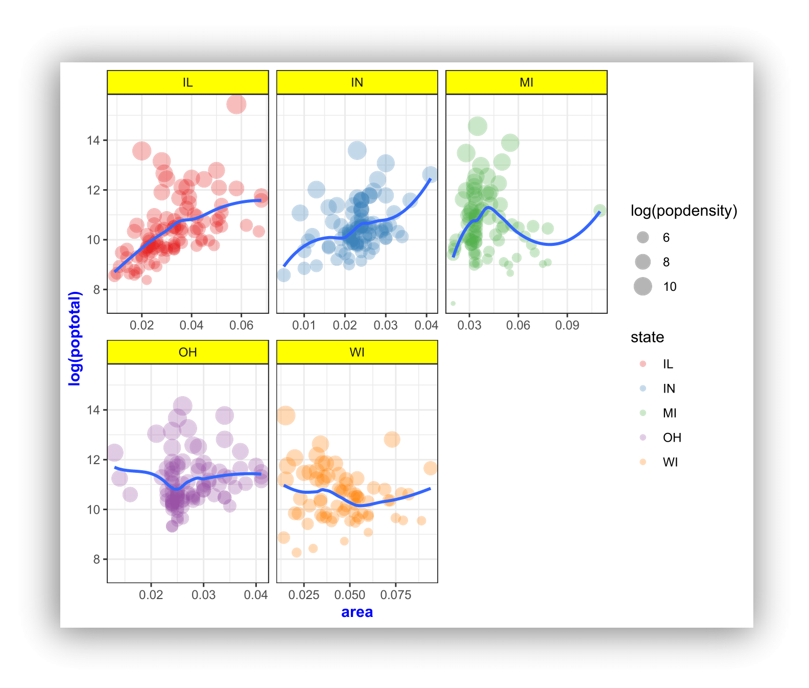

# R Graphics

**Topics**

* R `ggplot2` package basics
* Geometric objects and aesthetics
* Aesthetic inheritance
* Aesthetic mapping versus assignment
* Statistical transformations
* Add and modify scales and legends
* Statify plots using facets
* Manipulate plot labels
* Change and create plot themes


## Setup

### Software and Materials

Follow the [R Installation](./Rinstall.html) instructions and ensure that you can successfully start RStudio.

### Class Structure

Informal - Ask questions at any time. Really!

Collaboration is encouraged - please spend a minute introducing yourself to your neighbors!

### Prerequisites

This is an intermediate R course:

* Assumes working knowledge of R
* Relatively fast-paced

### Launch an R session

Start RStudio and create a new project:

* On Windows click the start button and search for RStudio. On Mac RStudio will be in your applications folder.
* In Rstudio go to `File -> New Project`.
* Choose `Existing Directory` and browse to the workshop materials directory on your desktop.
* Choose `File -> Open File` and select the file with the word "BLANK" in the name.

### Packages

You should have already installed the `tidyverse` and `rmarkdown` packages onto your computer before the workshop --- see [R Installation](./Rinstall.html). Now let's load these packages into the search path of our R session.

```{r}
library(tidyverse)
library(rmarkdown)
```

The `ggplot2` package is contained within `tidyverse`, but we also want to install two additional packages, `scales` and `ggrepel`, which provide additional functionality.

```{r}
# install.packages("scales")
library(scales)

# install.packages("ggrepel") 
library(ggrepel)
```

### Goals

We will learn about the `grammar of graphics` --- a system for understanding the building blocks of a graph --- using the `ggplot2` package. In particular, we'll learn about:  

1.  Basic plots, **aesthetic mapping and inheritance**
2.  Tailoring **statistical transformations** to particular plots
3.  **Modifying scales** to change axes and add labels
4.  **Faceting** to create many small plots
5.  Changing plot **themes**

## Why `ggplot2`?

`ggplot2` is a package within in the `tidyverse` suite of packages. Advantages of `ggplot2` include:

* consistent underlying `grammar of graphics` (Wilkinson, 2005)
* very flexible --- plot specification at a high level of abstraction
* theme system for polishing plot appearance
* many users, active mailing list

That said, there are some things you cannot (or should not) do with `ggplot2`:

* 3-dimensional graphics (see the `rgl` package)
* Graph-theory type graphs (nodes/edges layout; see the `igraph` package)
* Interactive graphics (see the `ggvis` package)


### What is the Grammar Of Graphics?

The basic idea: independently specify plot building blocks and combine them to create just about any kind of graphical display you want. Building blocks of a graph include the following (**bold denotes essential elements**):

* **data**
* **aesthetic mapping**
* **geometric object**
* statistical transformations
* scales
* coordinate system
* position adjustments
* faceting
* themes

By the end of this workshop, you should understand what these building blocks do and how to use them to create the following plot:




### `ggplot2` VS base graphics

Compared to base graphics, `ggplot2`

* is more verbose for simple / canned graphics
* is less verbose for complex / custom graphics
* does not have methods (data should always be in a `data.frame`)
* has sensible defaults for generating legends


## Geometric objects & aesthetics

### Aesthetic mapping

In ggplot land *aesthetic* means "something you can see". Examples include:

* position (i.e., on the x and y axes)
* color ("outside" color)
* fill ("inside" color)
* shape (of points)
* linetype
* size

Each type of geom accepts only a subset of all aesthetics; refer to the geom help pages to see what mappings each geom accepts. Aesthetic mappings are set with the `aes()` function.

### Geometric objects (`geom`)

Geometric objects are the actual marks we put on a plot. Examples include:

* points (`geom_point()`, for scatter plots, dot plots, etc.)
* lines (`geom_line()`, for time series, trend lines, etc.)
* boxplot (`geom_boxplot()`, for boxplots!)

A plot **must have at least one geom**; there is no upper limit. You can add a geom to a plot using the `+` operator.

Each `geom_` has a particular set of aesthetic mappings associated with it. Some examples are provided below, with required aesthetics in **bold** and optional aesthetics in plain text:

| `geom_`          | Usage             | Aesthetics                                                                      |
|:-----------------|:------------------|:-----------------------------------------------------------------------------------------|
| `geom_point()`   | Scatter plot      |**`x`**,**`y`**,`alpha`,`color`,`fill`,`group`,`shape`,`size`,`stroke`                    |
| `geom_line()`    | Line plot         |**`x`**,**`y`**,`alpha`,`color`,`linetype`,`size`                                         |
| `geom_bar()`     | Bar chart         |**`x`**,**`y`**,`alpha`,`color`,`fill`,`group`,`linetype`,`size`                          |
| `geom_boxplot()` | Boxplot           |**`x`**,**`lower`**,**`upper`**,**`middle`**,**`ymin`**,**`ymax`**,`alpha`,`color`,`fill` |
| `geom_density()` | Density plot      |**`x`**,**`y`**,`alpha`,`color`,`fill`,`group`,`linetype`,`size`,`weight`                 |
| `geom_smooth()`  | Conditional means |**`x`**,**`y`**,`alpha`,`color`,`fill`,`group`,`linetype`,`size`,`weight`                 |
| `geom_label()`   | Text              |**`x`**,**`y`**,**`label`**,`alpha`,`angle`,`color`,`family`,`fontface`,`size`            |

You can get a list of all available geometric objects and their associated aesthetics at <https://ggplot2.tidyverse.org/reference/>. Or, simply type `geom_<tab>` in any good R IDE (such as Rstudio) to see a list of functions starting with `geom_`.


#### Points (scatterplot)

Now that we know about geometric objects and aesthetic mapping, we can make a ggplot. To add points to a plot, `geom_point()` requires mappings for x and y, all others are optional.

**Example data: housing prices**

Let's look at data on housing prices.

```{r}

    # view first 5 columns

# create a subset for 1st quarter 2001

```

**Step 1:** create a blank canvas by specifying data:

```{r} 

```

**Step 2:** specify aesthetic mappings (how you want to map variables to visual aspects):

```{r}
# here we map "Land_Value" and "Structure_Cost" to the x- and y-axes.

```

**Step 3:** add new layers of geometric objects that will show up on the plot: 

```{r}
# here we use geom_point() to add a layer with point (dot) elements 
# as the geometric shapes to represent the data.


```


#### Lines (prediction line)

A plot constructed with `ggplot()` can have more than one geom. In that case the mappings established in the `ggplot()` call are plot defaults that can be added to or overridden --- this is referred to as **aesthetic inheritance**. Our plot could use a regression line:

```{r}
# get predicted values from a linear regression


# here we store the 'base plot' - without geometric objects - in the object 'p1'


# we can then add geometric objects to our base plot 'p1'
    # values for x and y are inherited from the ggplot() call above
    # add predicted values to the plot overriding the y values from the ggplot() call above
```


#### Smoothers

Not all geometric objects are simple shapes; the smooth geom includes a line and a ribbon.

```{r}
# add smooth geom to base plot

```


#### Text (label points)

Each geom accepts a particular set of mappings; for example `geom_text()` accepts a `label` mapping.

```{r}
# add text geom to base plot

```

But what if we want to include points and labels? We can use `geom_text_repel()` to keep labels from overlapping the points and each other.

```{r}
# add points and text geoms to base plot

```


### Aesthetic mapping VS assignment

1.  Variables are **mapped** to aesthetics within the `aes()` function

```{r}
# map `Home_Value` to point size

```

2.  Constants are **fixed** to aesthetics outside the `aes()` call

```{r}
# assign all points a size of 2

```

This sometimes leads to confusion, as in this example:

```{r}

    # incorrect! 2 is not a variable
    # this is fine -- all points red
```


### Mapping variables to other aesthetics

Other aesthetics are mapped in the same way as x and y in the previous example.

```{r}
# map `Home_Value` to color and `Region` to shape

```


### Exercise 0

The data for the exercises is available in the `dataSets/EconomistData.csv` file. Read it in with

```{r}
dat <- read_csv("dataSets/EconomistData.csv")
```

Original sources for these data are <http://www.transparency.org/content/download/64476/1031428> <http://hdrstats.undp.org/en/indicators/display_cf_xls_indicator.cfm?indicator_id=103106&lang=en>

These data consist of *Human Development Index* and *Corruption Perception Index* scores for several countries.

1.  Create a scatter plot with `CPI` on the x axis and `HDI` on the y axis.
```{r}

```

2.  Color the points in the previous plot blue.
```{r}

```

3.  Map the color of the the points to `Region`.
```{r}

```

4.  Keeping color mapped to `Region`, make the points bigger by setting size to 2
```{r}

```

5.  Keeping color mapped to `Region`, map the size of the points to `HDI_Rank`
```{r}

```


## Statistical transformations

### Why transform data?

Some plot types (such as scatterplots) do not require transformations; each point is plotted at x and y coordinates equal to the original value. Other plots, such as boxplots, histograms, prediction lines etc. require statistical transformations:

* For a boxplot, the y values must be transformed to the median, quartiles, and 1.5 times the interquartile range.
* For a smoother, the y values must be transformed into predicted mean values


### Setting arguments

Each `geom_` function has a default statistic that it is paired with and, likewise, each `stat_` function has a default geometic object that it is paired with. For example, the default statistic for `geom_histogram()` is "bin" (called by the `stat_bin()` function), while the default geometric object for `stat_bin()` is "bar" (called by the `geom_bar()` function). These defaults can be changed. 

Arguments to `stat_` functions can be passed through `geom_` functions and vice versa. This can be slightly annoying, because if you are using a `geom_` function, in order to specify some arguments you may have to first determine which statistic the geometric object uses, then determine the arguments to that `stat_` function.

Let's look at the arguments for the histogram geometric object (`geom_histogram()`):

```{r}

```

Notice that the third argument is `stat = "bin"`, which calls the `stat_bin()` function. This is how the histogram geom is, by default, paired with the bin statistic. The fifth argument is `...`, which allows us to pass certain arguments to `stat_bin()` through our call to `geom_histogram()`. Now let's look at the arguments available through `stat_bin()`:

```{r}

```

The tenth argument is `breaks`, which allows us to supply a numeric vector of bin boundaries. Notice that this argument is *not* available in `geom_histogram()`, but we can still supply the argument and it will be passed to `stat_bin()` through the `...` argument.

For example, here is the default histogram of `Home_Value`:

```{r}
# histogram of `Home_Value`

```

We can change the boundaries for the bins by passing the `breaks` argument through `geom_histogram()` to the `stat_bin()` function:

```{r}
# change bin boundaries for histogram

```

For reference, here is a list of geometric objects and their default statistics <https://ggplot2.tidyverse.org/reference/>.


### Changing the transformation

Sometimes the default statistical transformation is not what you need. This is often the case with pre-summarized data. Let's create a new variable `Home_Value_Mean` that is the mean of `Home_Value` for each `State`:

```{r}
# create new variable that is the mean of 'Home Value' for each 'State'
housing_sum <- 
  housing %>%
  group_by(State) %>%
  summarize(Home_Value_Mean = mean(Home_Value)) %>%
  ungroup()

head(housing_sum)
```

Now let's try to create a bar chart using this pre-summarized data:

```{r, eval=FALSE, error=TRUE}
# barchart using pre-summarized data


## Error: stat_count() must not be used with a y aesthetic.  
```

What is the problem with the previous plot? Basically, we take binned and summarized data and ask `ggplot()` to bin and summarize it again (`geom_bar()` defaults to `stat = stat_count`). Obviously this will not work. We can fix it by telling `geom_bar()` to use a different statistical transformation function. The `identity` function returns the same output as the input.

```{r}
# change the statistical transformation function

```


### Exercise 1

1.  Re-create a scatter plot with `CPI` on the x axis and `HDI` on the y axis (as you did in the previous exercise).
```{r}


```

2.  Overlay a smoothing line on top of the scatter plot using `geom_smooth()`.
```{r}


```

3.  Make the smoothing line in `geom_smooth()` less smooth. Hint: see `?loess`.
```{r}


```

4.  Change the smoothing line in `geom_smooth()` to use a linear model for the predictions. Hint: see `?stat_smooth`.
```{r}


```

5.  BONUS 1: Allow the smoothing line created in the last plot to vary across the levels of `Region`. Hint: map `Region` to the color and fill aesthetics.
```{r}
 

```

6.  BONUS 2: Overlay a loess `(method = "loess")` smoothing line on top of the scatter plot using `geom_line()`. Hint: change the statistical transformation.
```{r}


```


## Scales

### Controlling aesthetic mapping

Aesthetic mapping (i.e., with `aes()`) only says that a variable should be mapped to an aesthetic. It doesn't say *how* that should happen. For example, when mapping a variable to *shape* with `aes(shape = x)` you don't say *what* shapes should be used. Similarly, `aes(color = y)` doesn't say *what* colors should be used. Also, `aes(size = z)` doesn't say *what* sizes should be used. Describing what colors/shapes/sizes etc. to use is done by modifying the corresponding *scale*. In `ggplot2` scales include:

* position
* color and fill
* size
* shape
* line type

Scales are modified with a series of functions using a `scale_<aesthetic>_<type>` naming scheme. Try typing `scale_<tab>` to see a list of scale modification functions.

### Common scale arguments

The following arguments are common to most scales in `ggplot2`:

* **name:** the axis or legend title
* **limits:** the minimum and maximum of the scale
* **breaks:** the points along the scale where labels should appear
* **labels:** the labels that appear at each break

Specific scale functions may have additional arguments; for example, the `scale_color_continuous()` function has arguments `low` and `high` for setting the colors at the low and high end of the scale.

### Scale modification examples

Start by constructing a dotplot showing the distribution of home values by `Date` and `State`.

```{r}
# base dotplot

```

Now modify the breaks and shorten the labels for the color scales:

```{r}
## modify color scale breaks and labels


```

Next change the low and high values to blue and red:

```{r}
# modify color scale low and high values


```


### Using different color scales

`ggplot2` has a wide variety of color scales; here is an example using `scale_color_gradient2()` to interpolate between three different colors.

```{r}
# modify color scale to interpolate between three different colors


```


### Available scales

Here's a partial combination matrix of available scales:

| `scale_`          | Types        |  Examples                   |
|:------------------|:-------------|:----------------------------|
| `scale_color_`    | `identity`   | `scale_fill_continuous()`   |
| `scale_fill_`     | `manual`     | `scale_color_discrete()`    |
| `scale_size_`     | `continuous` | `scale_size_manual()`       |
|                   | `discrete`   | `scale_size_discrete()`     |
|                   |              |                             |
| `scale_shape_`    | `discrete`   | `scale_shape_discrete()`    |
| `scale_linetype_` | `identity`   | `scale_shape_manual()`      |
|                   | `manual`     | `scale_linetype_discrete()` |
|                   |              |                             |
| `scale_x_`        | `continuous` | `scale_x_continuous()`      |
| `scale_y_`        | `discrete`   | `scale_y_discrete()`        |
|                   | `reverse`    | `scale_x_log()`             |
|                   | `log`        | `scale_y_reverse()`         |
|                   | `date`       | `scale_x_date()`            |
|                   | `datetime`   | `scale_y_datetime()`        |

Note that in RStudio you can type `scale_` followed by `tab` to get the whole list of available scales. For a complete list of available scales see <https://ggplot2.tidyverse.org/reference/>.


### Exercise 2

1.  Create a scatter plot with `CPI` on the x axis and `HDI` on the y axis. Color the points to indicate `Region`.
```{r}


```

2.  Modify the x, y, and color scales so that they have more easily-understood names (e.g., spell out "Human development Index" instead of `HDI`). Hint: see `?scale_x_continous`, `?scale_y_continuous`, and `?scale_color_discrete`.
```{r}


```

3.  Modify the color scale to use specific values of your choosing. Hint: see `?scale_color_manual`. NOTE: you can specify color by name (e.g., "blue") or by "Hex value" --- see <https://www.color-hex.com/>.
```{r}


```


## Faceting

### What is faceting?

* Faceting is `ggplot2` parlance for **creating individual graphs for subsets of data**
* `ggplot2` offers two functions for creating facets:
    1.  `facet_wrap()`: define subsets as the levels of a single grouping variable
    2.  `facet_grid()`: define subsets as the crossing of two grouping variables
* Facets facilitate comparison among plots, not just of geoms within a plot

### What is the trend in housing prices in each state?

Start by using a technique we already know; map `State` to color:

```{r}
# map `State` to color
  
```

There are two problems here; there are too many states to distinguish each one by color, and the lines obscure one another.

### Faceting to the rescue

We can remedy the deficiencies of the previous plot by faceting by `State` rather than mapping `State` to color.

```{r}
# facet by `State`

```


## Themes

### What are themes?

The `ggplot2` theme system handles non-data plot elements such as:

* Axis label properties (e.g., font, size, color, etc.)
* Plot background
* Facet label background
* Legend appearance

Built-in themes include:

* `theme_gray()` (default)
* `theme_bw()`
* `theme_classic()`

Here are a couple of examples:

```{r}
# theme linedraw

```

```{r}
# theme light

```

You can see a list of available built-in themes here: <https://ggplot2.tidyverse.org/reference/>.


### Overriding theme defaults

Specific theme elements can be overridden using `theme()`. For example:

```{r}
# theme(thing_to_modify = modifying_function(arg1, arg2))


 
```

All theme options are documented in `?theme`. We can also see the existing default values using:

```{r, eval=FALSE}
theme_get()
```

### Creating & saving new themes

You can create new themes, as in the following example:

```{r}
theme_new <- theme_bw() +
  theme(plot.background = element_rect(size = 1, color = "blue", fill = "black"),
        text = element_text(size = 12, color = "ivory"),
        axis.text.y = element_text(colour = "purple"),
        axis.text.x = element_text(colour = "red"),
        panel.background = element_rect(fill = "pink"),
        strip.background = element_rect(fill = muted("orange")))

p4 + theme_new
```

## Saving plots

We can save a plot to either a vector (e.g., pdf, eps, ps, svg) or raster (e.g., jpg, png, tiff, bmp, wmf) graphics file using the `ggsave()` function:

```{r, eval=FALSE}
# save plot output to a file

```


## The #1 FAQ

### Map aesthetic to different columns

The most frequently asked question goes something like this: *"I have two variables in my data.frame, and I'd like to plot them as separate points, with different color depending on which variable it is. How do I do that?"*

**Wrong way**

Fixing, rather than mapping, the color aesthetic:

1.  Produces verbose code when using many colors
2.  Results in no legend being produced
3.  Means you cannot change color scales


To see this, let's first calculate summary home and land value data:

```{r}
# get summary home and land value data
housing_byyear <- 
  housing %>%
  group_by(Date) %>%
  summarize(Home_Value_Mean = mean(Home_Value),
            Land_Value_Mean = mean(Land_Value)) %>%
  ungroup()
```

Now let's assign the color aesthetic to the line geom for each variable:

```{r}
# assigning the color aesthetic to constants


```

**Right way**

To avoid these pitfalls, we need to **map** our data to the color aesthetic. We can do this by **reshaping** our data from **wide format** to **long format**. Here is the logic behind this process:


Here's the code that implements this transformation using `pivot_longer()`:

```{r}
# reshape data from wide to long
home_land_byyear <- 
    housing_byyear %>%
    pivot_longer(cols = c(Home_Value_Mean, Land_Value_Mean),
                 names_to = "type",
                 values_to = "value")
```

Now we can map all our variables to the color aesthetic simultaneously, and `ggplot()` will automatically create a legend for us:

```{r}     
# map data to the color aesthetic                    
ggplot(home_land_byyear, aes(x = Date, y = value, color = type)) +
  geom_line()
```


### Exercise 3

For this exercise, we're going to use the built-in `midwest` dataset:

```{r}
data("midwest", package = "ggplot2")
head(midwest)
```

1.  Create a scatter plot with `area` on the x axis and the log of `poptotal` on the y axis. 
```{r}


```

2.  Within the `geom_point()` call, map color to `state`, map size to the log of `popdensity`, and fix transparency (`alpha`) to 0.3.
```{r}
 

```

3.  Add a smoother and turn off plotting the confidence interval. Hint: see the `se` argument to `geom_smooth()`.
```{r}


```

4.  Facet the plot by `state`. Set the `scales` argument to `facet_wrap()` to allow separate ranges for the x-axis.
```{r}


```

5.  Change the default color scale to use the discrete `RColorBrewer` palette called `Set1`. Hint: see `?scale_color_brewer`.
```{r}


```

6.  BONUS: Change the default theme to `theme_bw()` and modify it so that the axis text and facet label background are blue. Hint: see `?theme` and especially `axis.text` and `strip.background`.
```{r}


```


## Wrap-up

### Feedback

These workshops are a work in progress, please provide any feedback to: help@iq.harvard.edu

### Resources

* IQSS 
    + Workshops: <https://dss.iq.harvard.edu/workshop-materials>
    + Data Science Services: <https://dss.iq.harvard.edu/>
    + Research Computing Environment: <https://iqss.github.io/dss-rce/>

* HBS
    + Research Computing Services workshops: <https://training.rcs.hbs.org/workshops>
    + Other HBS RCS resources: <https://training.rcs.hbs.org/workshop-materials>
    + RCS consulting email: <mailto:research@hbs.edu>
    
* ggplot2
    + Reference: <https://ggplot2.tidyverse.org/reference/>
    + Cheatsheets: <https://rstudio.com/wp-content/uploads/2019/01/Cheatsheets_2019.pdf>
    + Examples: <http://r-statistics.co/Top50-Ggplot2-Visualizations-MasterList-R-Code.html>
    + Tutorial: <https://uc-r.github.io/ggplot_intro>
    + Mailing list: <http://groups.google.com/group/ggplot2>
    + Wiki: <https://github.com/hadley/ggplot2/wiki>
    + Website: <http://had.co.nz/ggplot2/>
    + StackOverflow: <http://stackoverflow.com/questions/tagged/ggplot>

