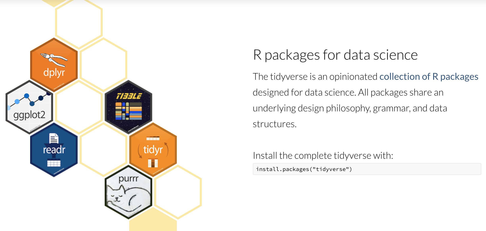

# R Introduction

**Topics**

* Assignment
* Function arguments
* Finding help
* Reading data
* Filtering rows, selecting columns, and arranging data
* Conditional operations
* Saving data


## Setup

### Software & materials

You should have R and RStudio installed --- if not:

* Download and install R: <http://cran.r-project.org>
* Download and install RStudio: <https://www.rstudio.com/products/rstudio/download/#download>

Download materials:

* Download class materials at <https://github.com/IQSS/dss-workshops-redux/raw/master/R/Rintro.zip>
* Extract materials from the zipped directory `Rintro.zip` (Right-click => Extract All on Windows, double-click on Mac) and move them to your desktop!

Start RStudio and create a new project:

* On Windows click the start button and search for RStudio. On Mac
    RStudio will be in your applications folder.
* In Rstudio go to `File -> New Project`.
* Choose `Existing Directory` and browse to the `Rintro` directory.
* Choose `File -> Open File` and select the blank version of the `.Rmd` file.


### Goals

Class Structure and Organization:

* Ask questions at any time. Really!
* Collaboration is encouraged - please spend a minute introducing yourself to your neighbors!

This is an introductory R course:

* Assumes no prior knowledge of R
* Relatively slow-paced
* The workshop covers R basics, the R package ecosystem, and practice reading files and manipulating data in R
* A more general goal is to get you comfortable with R so that it seems less scary and mystifying than it perhaps does now. Note that this is by no means a complete or thorough introduction to R! It's just enough to get you started.

As an example project we will analyze the popularity of baby names in the US from 1960 through 2017. Among the questions we will answer using R are:

* In which year did your name achieve peak popularity?
* How many children were born each year?
* What are the most popular names overall? For girls? For Boys?


## R Interfaces

There are many different ways you can interact with R. See the
[Data Science Tools workshop notes](./DataScienceTools.html) 
for details.

For this workshop we will use [RStudio](https://rstudio.com/); it is a good
R-specific integrated development environment (IDE) with many features.

There are also several different formats for writing code for R. Two of
the most popular are:

1. **R scripts** --- a type of plain text file that allows you to write R code
and basic comments about the code: 

2. [**Rmarkdown**](https://rmarkdown.rstudio.com/) --- a type of text file that 
allows you to include plain text with R code and easily convert the contents
into HTML (for a webpage), MS Word, or PDF (via LaTeX). Many people write 
their journal papers, dissertations, and statistics/math class notes in 
Rmarkdown, since it is easy to use and to convert into other formats later.


## Exercise 0

The purpose of this exercise is to give you an opportunity to explore
the interface provided by RStudio. You may not know how to do these things; 
that's fine! This is an opportunity to figure it out.

Also keep in mind that we are living in a golden age of tab completion.
If you don't know the name of an R function, try guessing the first two
or three letters and pressing TAB. If you guessed correctly the function
you are looking for should appear in a pop up!

-------------------------------------------

1.  Try to get R to add 2 plus 2.
```{r}
##
```
2.  Try to calculate the square root of 10.
```{r}
##
```
3.  R includes extensive documentation, including a manual named "An
    introduction to R". Use the RStudio help pane. to locate this manual.

```{r}
##
```


## R basics

### Function calls

The general form for calling R functions is

```{r}
# FunctionName(arg.1 = value.1, arg.2 = value.2, ..., arg.n - value.n)
```

Arguments can be **matched by name**; unnamed arguments will be **matched by position**.

```{r}
#
# match by name
# match by position
# be careful when matching by position!
# matching by name is safer!
```

### Assignment

Values can be assigned names and used in subsequent operations

* The **gets** `<-` operator (less than followed by a dash) is used to save values
* The name on the left **gets** the value on the right.

```{r}
## calculate square root of 10; result is not stored anywhere
# assign result to a variable named x
```

Names should start with a letter, and contain only letters, numbers, underscores, and periods.


### Asking R for help

You can ask R for help using the `help` function, or the `?` shortcut.

```{r, eval=FALSE}
#

```

The `help` function can be used to look up the documentation for a function, or
to look up the documentation to a package. We can learn how to use the `stats`
package by reading its documentation like this:

```{r, eval=FALSE}
#

```


## Getting data into R

R has data reading functionality built-in -- see e.g.,
`help(read.table)`. However, faster and more robust tools are
available, and so to make things easier on ourselves we will use a
*contributed package* instead. This requires that we
learn a little bit about packages in R.


### Installing & using R packages

A large number of contributed packages are available. If you are
looking for a package for a specific task,
https://cran.r-project.org/web/views/ and https://r-pkg.org are good
places to start.

You can install a package in R using the `install.packages()`
function. Once a package is installed you may use the `library()`
function to attach it so that it can be used.

While R's built-in packages are powerful, in recent years there has
been a big surge in well-designed *contributed packages* for R. In 
particular, a collection of R packages called 
[`tidyverse`](https://www.tidyverse.org/) have been 
designed specifically for data science. All packages included in 
`tidyverse` share an underlying design philosophy, grammar, and 
data structures. We will use `tidyverse` packages throughout the 
workshop, so let's install them now:

```{r}
# install.packages("tidyverse")
#

```




We can also install the `rmarkdown` package, which will allow us to
combine our text and code into a formatted document at the end of 
the workshop:

```{r}
## install.packages("rmarkdown")
library(rmarkdown)
```


### Readers for common file types

To read data from a file, you have to know what kind of file
it is. The table below lists functions from the `readr` package, which
is part of `tidyverse`, that can import data from common plain-text formats.

| Data Type                 | Function        |
|:--------------------------|:----------------|
| comma separated           | `read_csv()`    |
| tab separated             | `read_delim()`  |
| other delimited formats   | `read_table()`  |
| fixed width               | `read_fwf()`    |

**Note** You may be confused by the existence of similar functions,
e.g., `read.csv` and `read.delim`. These are legacy functions that
tend to be slower and less robust than the `readr` functions. One way
to tell them apart is that the faster more robust versions use
underscores in their names (e.g., `read_csv`) while the older
functions use dots (e.g., `read.csv`). My advice is to use the more
robust newer versions, i.e., the ones with underscores.

### Baby names data

The examples in this workshop use US baby names data retrieved from
https://catalog.data.gov/dataset/baby-names-from-social-security-card-applications-national-level-data
A cleaned and merged version of these data is available at
`http://tutorials.iq.harvard.edu/data/babyNames.csv`.


## Exercise 1

**Reading the baby names data** 

Make sure you have installed the `tidyverse` suite of packages and attached them with `library(tidyverse)`. 
Baby names data are available at `"http://tutorials.iq.harvard.edu/data/babyNames.csv"`.

1. Open the `read_csv` help page to determine how to use it to read in data.
```{r}
##

```

2. Read the baby names data using the `read_csv` function and assign the result 
with the name `baby_names`.
```{r}
##

```


## Popularity of your name

In this section we will pull out specific names and examine changes in 
their popularity over time. 

The `baby_names` object we created in the last exercise is a `data.frame`.
There are many other data structures in R, but for now we'll focus on 
working with `data.frames`. 

R has decent data manipulation tools built-in -- see e.g.,
`help(Extract)`. But, `tidyverse` packages often provide
more intuitive syntax for accomplishing the same task. In
particular, we will use the `dplyr` package from `tidyverse`
to filter, select, and arrange data.


### Filtering, selecting, & arranging data

One way to find the year in which your name was the most popular
is to filter out just the rows corresponding to your name, and 
then arrange (sort) by Count. 

To demonstrate these techniques we'll try to determine whether 
"Alex"" or "Mark" was more popular in 1992. We start by filtering the
data so that we keep only rows where Year is equal to `1992` and Name is
either "Alex" or "Mark".

```{r}
#

```

Notice that we can combine conditions using `&` (AND) 
and `|` (OR). 

In this case it's pretty easy to see that "Mark" is more popular, 
but to make it even easier we can arrange the data so that the 
most popular name is listed first.

```{r}
#

```

```{r}
#

```

We can also use the `select()` function to subset the `data.frame`
by columns. We can then assign the output to a new object.  

```{r}
#

```


### Other logical operators

In the previous example we used `==` to filter rows. Other relational
and logical operators are listed below.

 | Operator  | Meaning                   | 
 |:----------|:--------------------------| 
 | `==`      | equal to                  | 
 | `!=`      | not equal to              | 
 | `>`       | greater than              | 
 | `>=`      | greater than or equal to  | 
 | `<`       | less than                 | 
 | `<=`      | less than or equal to     | 
 | `%in%`    | contained in              | 

These operators may be combined with `&` (and) or `|` (or).


## Exercise 2.1

**Peak popularity of your name**

In this exercise you will discover the year your name reached its maximum popularity.

Read in the "babyNames.csv" file if you have not already done so,
assigning the result to `baby_names`. The file is located at 
`"http://tutorials.iq.harvard.edu/data/babyNames.csv"`

Make sure you have installed the `tidyverse` suite of packages and attached them with `library(tidyverse)`.

1.  Use `filter` to extract data for your name (or another name of your choice).  
```{r}
##

```

2.  Arrange the data you produced in step 1 above by `Count`. 
    In which year was the name most popular?
```{r}
##

```

3.  BONUS (optional): Filter the data to extract *only* the 
     row containing the most popular boys name in 1999.
```{r}
##

```


## Pipe operator in R

There is one very special operator in R called a "pipe" operator that 
looks like this: `%>%`. It allows us to "chain" several function calls and, 
as each function returns an object, feed it into the next call in a single 
statement, without needing extra variables to store the intermediate 
results. The point of the pipe is to help you write code in a way that is
easier to read and understand as we will see below.

There is no need to load any additional packages as the operator is made 
available via the `magrittr` package installed as part of `tidyverse`. Let's 
rewrite the sequence of commands to output ordered counts for names 
"Alex" or "Mark".

```{r}
#

```

Hint: try pronouncing "then" whenever you see `%>%`. Notice that we avoided 
creating an intermediate variable `baby_names_alexmark` and performed the 
entire task in just "one line"!


## Exercise 2.2

Rewrite the solution to Exercise 2.1 using pipes. Remember that we were looking
for the year your name reached its maximum popularity. For that, we filtered 
the data and then arranged by `Count.`

```{r}
##

```


## Plotting baby name trends over time

It can be difficult to spot trends when looking at summary tables.
Plotting the data makes it easier to identify interesting patterns.

R has decent plotting tools built-in -- see e.g., `help(plot)`.
However, again, we will make use of an excelent *contributed
package* from `tidyverse` called `ggplot2`.

For quick and simple plots we can use the `qplot()` function. For example,
we can plot the number of babies given the name "Diana" over time like this:

```{r}
#

```


Interestingly, there are usually some gender-atypical names, even for very strongly 
gendered names like "Diana". Splitting these trends out by Sex is very easy:

```{r}
#

```


## Exercise 3 

**Plotting peak popularity of your name**

Make sure the `tidyverse` suite of packages is installed, and that you 
have attached them using `library(tidyverse)`.

1.  Use `filter` to extract data for your name (same as previous exercise)
```{r}
##

```

2.  Plot the data you produced in step 1 above, with `Year` on the x-axis
    and `Count` on the y-axis.
```{r}
##

```

3. Adjust the plot so that is shows boys and girls in different colors.
```{r}
##

```

4. BONUS (Optional): Adust the plot to use lines instead of points.
```{r}
##

```


## Finding the most popular names

Our next goal is to find out which names have been the most popular.

### Computing better measures of popularity

So far we've used `Count` as a measure of popularity. A better
approach is to use proportion or rank to avoid confounding 
popularity with the number of babies born in a given year. 

The `mutate()` function makes it easy to add or modify the columns 
of a `data.frame`. For example, we can use it to rescale the count
 of each name in each year:

```{r}
#

```

Notice that executing the second line led to printing all 1 million
rows in our `data.frame`! If we would just like to glance at the
first 6 lines we can use the `head()` function:

```{r}
#

```

If we like, we can also `select()` a subset of columns from the baby names data:

```{r}
#

```

### Operating by group

Because of the nested nature of our data, we want to compute rank 
or proportion  within each `Sex` by `Year` group. The `dplyr` 
package makes this relatively straightforward.


```{r}
#

```

Note that the data remains grouped until you change the groups by
running `group_by()` again or remove grouping information with
`ungroup()`.


## Exercise 4

**Most popular names**

In this exercise your goal is to identify the most popular names for each year.

1.  Use `mutate()` and `group_by()` to create a column named "Proportion"
    where `Proportion = Count/sum(Count)` for each `Year X Sex` group.
    Use pipes wherever it makes sense.
```{r}
## 

```

2.  Use `mutate()` and `group_by()` to create a column named "Rank" where 
    `Rank = rank(-Count)` for each `Year X Sex` group. 
```{r}
##

```

3.  Filter the baby names data to display only the most popular name 
    for each `Year X Sex` group. Keep only the columns: Name, Sex, and Proportion, and Year. 
```{r}
##

```

4. Plot the data produced in step 4, putting `Year` on the x-axis
    and `Proportion` on the y-axis. How has the proportion of babies
    given the most popular name changed over time?
```{r}
##

```

5. BONUS (optional): Which names are the most popular for both boys and girls?
```{r}
##

```

## Percent choosing one of the top 10 names

You may have noticed that the percentage of babies given the most 
popular name of the year appears to have decreased over time. We can
compute a more robust measure of the popularity of the most popular
names by calculating the number of babies given one of the top 10 girl
or boy names of the year.

To compute this measure we need to operate within groups, as
we did using `mutate()` above, but this time we need to collapse each
group into a single summary statistic. We can achieve this using the
`summarize()` function. 

First, let's see how this function works without grouping. The following 
code outputs the total number of girls and boys in the data:
```{r}
#

```

Next, using `group_by()` and `summarize()` together, we can calculate the 
number of babies born each year:

```{r}
#

```


## Exercise 5

**Popularity of the most popular names**

In this exercise we will plot trends in the proportion of boys and girls 
given one of the 10 most popular names each year.

1.  Filter the `baby_names` data, retaining only the 10 most popular girl
    and boy names for each year.
```{r}
##

```

2.  Summarize the data produced in step one to calculate the total
    Proportion of boys and girls given one of the top 10 names
    each year.
```{r}
##

```

3.  Plot the data produced in step 2, with year on the x-axis
    and total proportion on the y axis. Color by sex and notice
    the trend.
```{r}
##

```


## Saving our Work

Now that we have made some changes to our data set, we might want to
save those changes to a file.

### Saving individual datasets

You might find functions `write_csv()` and `write_rds()` from package 
`readr` handy!

```{r, eval=FALSE}
#

```

```{r, eval=FALSE}
# write data to a .csv file
# write data to an R file

```

### Saving multiple datasets

```{r, eval=FALSE}
# list objects in our workspace
#
```

```{r, eval=FALSE}
## Load the "myDataFiles.RData"
## load("myDataFiles.RData") 
```

### Saving & loading R workspaces

In addition to importing individual datasets, R can save and load entire
workspaces

```{r, eval=FALSE}
# list objects in our workspace
# save workspace 
# remove all objects from our workspace 
# list stored objects to make sure they are deleted

```

```{r, eval=FALSE}
## Load the "myWorkspace.RData" file and check that it is restored
# load myWorkspace.RData
# list objects
```


## Wrap-up

### Feedback

These workshops are a work-in-progress, please provide any feedback to: help@iq.harvard.edu

### Resources

* IQSS 
    + Workshops: <https://dss.iq.harvard.edu/workshop-materials>
    + Data Science Services: <https://dss.iq.harvard.edu/>
    + Research Computing Environment: <https://iqss.github.io/dss-rce/>

* HBS
    + Research Computing Services workshops: <https://training.rcs.hbs.org/workshops>
    + Other HBS RCS resources: <https://training.rcs.hbs.org/workshop-materials>
    + RCS consulting email: <mailto:research@hbs.edu>

* Software (all free!):
    + R and R package download: <http://cran.r-project.org>
    + Rstudio download: <http://rstudio.org>
    + ESS (emacs R package): <http://ess.r-project.org/>

* Online tutorials
    + <http://www.codeschool.com/courses/try-r>
    + <http://www.datacamp.org>
    + <https://rmarkdown.rstudio.com/lesson-1.html>
    + <http://swirlstats.com/>
    + <http://r4ds.had.co.nz/>

* Getting help:
    + Documentation and tutorials: <http://cran.r-project.org/other-docs.html>
    + Recommended R packages by topic: <http://cran.r-project.org/web/views/>
    + Mailing list: <https://stat.ethz.ch/mailman/listinfo/r-help>
    + StackOverflow: <http://stackoverflow.com/questions/tagged/r>
    + R-Bloggers: <https://www.r-bloggers.com/>

* Coming from ...
    + Stata: <http://www.princeton.edu/~otorres/RStata.pdf>
    + SAS/SPSS: <http://r4stats.com/books/free-version/>
    + Matlab: <http://www.math.umaine.edu/~hiebeler/comp/matlabR.pdf>
    + Python: <http://mathesaurus.sourceforge.net/matlab-python-xref.pdf>

