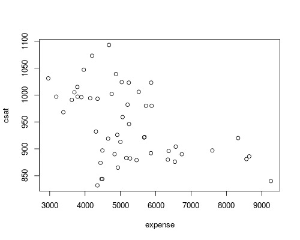
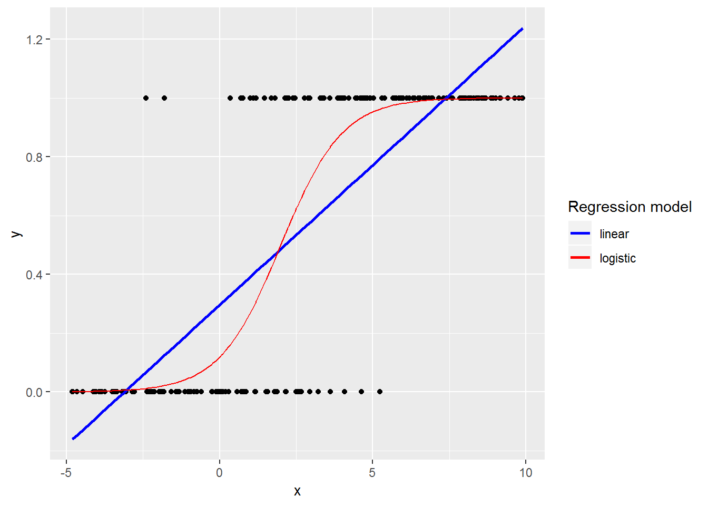
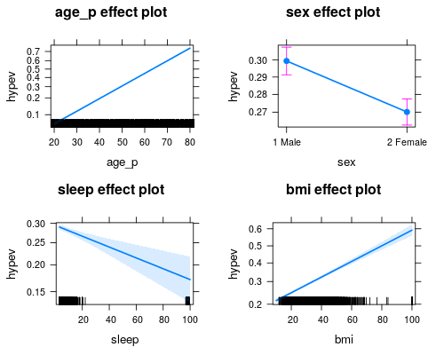

---
output:
  word_document: default
  html_document: default
---


# R Regression Models

**Topics**

* R formula interface
* Run and interpret variety of regression models in R
* Factor contrasts to test specific hypotheses
* Model comparisons
* Predicted marginal effects


## Setup

### Class Structure

* Informal --- Ask questions at any time. Really!
* Collaboration is encouraged - please spend a minute introducing yourself to your neighbors!

### Prerequisites

This is an intermediate R course:

* Assumes working knowledge of R
* Relatively fast-paced
* This is not a statistics course! We assume you know the theory behind the models.

### Launch an R session

Start RStudio and create a new project:

* On Windows click the start button and search for RStudio. On Mac
    RStudio will be in your applications folder.
* In Rstudio go to `File -> New Project`.
* Choose `Existing Directory` and browse to the workshop materials directory on your desktop.
* Choose `File -> Open File` and select the file with the word "BLANK" in the name.

### Packages

You should have already installed the `tidyverse` and `rmarkdown`
packages onto your computer before the workshop 
--- see [R Installation](./Rinstall.html). 
Now let's load these packages into the search path of our R session.

```{r}
library(tidyverse)
library(rmarkdown)
```

Finally, lets install some packages that will help with modeling:

```{r}
# install.packages("lme4")
library(lme4)  # for mixed models

# install.packages("emmeans")
library(emmeans)  # for marginal effects

# install.packages("effects")
library(effects)  # for predicted marginal means
```

### Workshop Outline

1.  Preliminary steps before modeling
2.  Modeling continuous outcomes
3.  Modeling binary outcomes
4.  Modeling clustered data


## Before fitting a model

### Load the data

List the data files we're going to work with:

```{r}

```

We're going to use the `states` data first, which originally appeared in *Statistics with Stata* by Lawrence C. Hamilton.

```{r}
  # read the states data
  

  # look at the last few rows
 
```

| Variable | Description                                        |
|:---------|:---------------------------------------------------|
| csat     | Mean composite SAT score                           |
| expense  | Per pupil expenditures                             |
| percent  | % HS graduates taking SAT                          |
| income   | Median household income, $1,000                    |
| region   | Geographic region: West, N. East, South, Midwest   |
| house    | House '91 environ. voting, %                       |
| senate   | Senate '91 environ. voting, %                      |
| energy   | Per capita energy consumed, Btu                    |
| metro    | Metropolitan area population, %                    |
| waste    | Per capita solid waste, tons                       |


### Examine the data

Start by examining the data to check for problems.

```{r}
  # summary of expense and csat columns, all rows


  # correlation between expense and csat
 
```

### Plot the data

Plot the data to look for multivariate outliers, non-linear relationships etc.

```{r}
  # scatter plot of expense vs csat
  
```




## Models with continuous outcomes

Ordinary least squares (OLS) regression models can be fit with the `lm()` function.
In R, we convert our theoretical model into a `formula` --- a symbolic representation of the model:

```{r, eval=FALSE}
# R regression formula
outcome ~ pred1 + pred2 + pred3

# NOTE: the ~ is a tilde
```

For example, we can use `lm()` to predict SAT scores based on per-pupil expenditures:

```{r}
  # Fit our regression model
  # regression formula
  # data 
                
  # Summarize and print the results
  # show regression coefficients table
```

### Why is the association between expense & SAT scores *negative*?

Many people find it surprising that the per-capita expenditure on students is negatively related to SAT scores. The beauty of multiple regression is that we can try to pull these apart. What would the association between expense and SAT scores be if there were no difference among the states in the percentage of students taking the SAT?

```{r}
  

```

### The `lm` class & methods

OK, we fit our model. Now what?

* Examine the model object:

```{r}
 


```

* Use function methods to get more information about the fit

```{r}


```

Selected **post-estimation** tools:

| Function      | Package        | Output                                                  |
|:--------------|:---------------|:--------------------------------------------------------|
| `summary()`   | `stats` base R | standard errors, test statistics, p-values, GOF stats   |
| `confint()`   | `stats` base R | confidence intervals                                    |
| `anova()`     | `stats` base R | anova table (one model), model comparison (> one model) |
| `coef()`      | `stats` base R | point estimates                                         |
| `drop1()`     | `stats` base R | model comparison                                        |
| `predict()`   | `stats` base R | predicted response values                               |
| `fitted()`    | `stats` base R | predicted response values (for observed data)           |
| `residuals()` | `stats` base R | residuals                                               |
| `fixef()`     | `lme4`         | fixed effect point estimates (mixed models only)        |
| `ranef()`     | `lme4`         | random effect point estimates (mixed models only)       |
| `coef()`      | `lme4`         | empirical Bayes estimates (mixed models only)           |
| `allEffects()`| `effects`      | predicted marginal means                                |
| `emmeans()`   | `emmeans`      | predicted marginal means & marginal effects             |
| `margins()`   | `margins`      | predicted marginal means & marginal effects             |


### OLS regression assumptions

OLS regression relies on several assumptions, including:

1. The model includes all relevant variables (i.e., no omitted variable bias).
2. The model is linear in the parameters (i.e., the coefficients and error term).
3. The error term has an expected value of zero.
4. All right-hand-side variables are uncorrelated with the error term.
5. No right-hand-side variables are a perfect linear function of other RHS variables.
6. Observations of the error term are uncorrelated with each other.
7. The error term has constant variance (i.e., homoscedasticity).
8. (Optional - only needed for inference). The error term is normally distributed.

Investigate assumptions #7 and #8 visually by plotting your model:

```{r}
  par(mfrow = c(2, 2)) # splits the plotting window into 4 panels
  plot(sat_mod)
```

### Comparing models

Do congressional voting patterns predict SAT scores over and above expense? Fit two models and compare them:

```{r}
  # fit another model, adding house and senate as predictors
  


```

What does `na.omit()` do?

```{r}
# fake data
dat <- data.frame(
  x = 1:5, 
  y = c(3, 2, 1, NA, 5), 
  z = c(6, NA, 2, 7, 3))
dat


# listwise deletion of observations

# also see
# ?complete.cases


```

Now let's update our first model using `na.omit()`:

```{r}
  

  # compare using an F-test with the anova() function
  

```

### Exercise 0

**Ordinary least squares regression**

Use the *states.rds* data set. Fit a model predicting energy consumed per capita (energy) from the percentage of residents living in metropolitan areas (`metro`). Be sure to

1.  Examine/plot the data before fitting the model
```{r}


```

2.  Print and interpret the model `summary()`
```{r}


```

3.  `plot()` the model to look for deviations from modeling assumptions
```{r}


```

4. Select one or more additional predictors to add to your model and repeat steps 1-3. Is this model significantly better than the model with `metro` as the only predictor?
```{r}


```


## Interactions & factors

### Modeling interactions

Interactions allow us assess the extent to which the association between one predictor and the outcome depends on a second predictor. For example: Does the association between expense and SAT scores depend on the median income in the state?

```{r}
    # Add the interaction to the model
  # same as above, but shorter syntax

  # Show the regression coefficients table
  
```

### Regression with categorical predictors

Let's try to predict SAT scores from region, a categorical variable. 
Note that you must make sure R does not think your categorical variable is numeric.

```{r}
  # make sure R knows region is categorical


  # arguments to the factor() function
  # factor(x, levels, labels)

  
```

```{r}
  # Add region to the model
 

  # Show the results
  # show the regression coefficients table
  # show ANOVA table
```

Again, **make sure to tell R which variables are categorical by converting them to factors!**


### Setting factor reference groups & contrasts

The default contrasts in R are "treatment" contrasts, or "dummy coding", with the first level as the reference category. 
We can also easily change the reference group or get all sets of pairwise contrasts.

```{r}
  # change the reference group
  

  # get all pairwise contrasts between means
 


```


### Exercise 1

**Interactions & factors**

Use the `states` data set.

1.  Add on to the regression equation that you created in Exercise 1 by generating an interaction term and testing the interaction.
```{r}


```

2.  Try adding region to the model. Are there significant differences across the four regions?
```{r}


```


## Models with binary outcomes

### Logistic regression

This far we have used the `lm()` function to fit our regression models. `lm()` is great, but limited--in particular it only fits models for continuous dependent variables. For categorical dependent variables we can use the `glm()` function.

For these models we will use a different dataset, drawn from the National Health Interview Survey. From the [CDC website](http://www.cdc.gov/nchs/nhis.htm):

> The National Health Interview Survey (NHIS) has monitored the health of the nation since 1957. NHIS data on a broad range of health topics are collected through personal household interviews. For over 50 years, the U.S. Census Bureau has been the data collection agent for the National Health Interview Survey. Survey results have been instrumental in providing data to track health status, health care access, and progress toward achieving national health objectives.

Load the National Health Interview Survey data:

```{r}
 


```

### Logistic regression example

Motivation for a logistic regression model --- with a binary response:

1.  Errors will not be normally distributed
2.  Variance will not be homoskedastic
3.  Predictions should be constrained to be on the interval [0, 1]




Anatomy of a generalized linear model:

```{r, eval=FALSE}
  # OLS model using lm()
  lm(outcome ~ 1 + pred1 + pred1, 
     data = mydata)

  # OLS model using glm()
  glm(outcome ~ 1 + pred1 + pred1, 
      data = mydata, 
      family = gaussian(link = "identity"))
 
  # logistic model using glm()
  glm(outcome ~ 1 + pred1 + pred1, 
      data = mydata, 
      family = binomial(link = "logit"))
```

The `family` argument sets the error distribution for the model, while the `link` function
argument relates the predictors to the expected value of the outcome.


Let's predict the probability of being diagnosed with hypertension based on `age`, `sex`, `sleep`, and `bmi`:

```{r}
  # check stucture of hypev
  # check levels of hypev

  # collapse all missing values to NA
  


  # run our regression model
  


```

### Logistic regression coefficients

Generalized linear models use link functions, so raw coefficients are difficult to interpret. For example, the `age` coefficient of .06 in the previous model tells us that for every one unit increase in `age`, the log odds of hypertension diagnosis increases by 0.06. Since most of us are not used to thinking in log odds this is not too helpful!

One solution is to transform the coefficients to make them easier to interpret. 
Here we transform them into odds ratios by exponentiating:

```{r}
 


```

### Packages for computing & graphing predicted values

Instead of doing all this ourselves, we can use the effects package to compute quantities of interest for us.

```{r}
  # "response" refers to the probability scale

  # generate a sequence at which to get predictions of the outcome
  

  # override defaults
  # confidence intervals
```




### Exercise 2 

**Logistic regression**

Use the `NH11` data set that we loaded earlier.

1.  Use `glm()` to conduct a logistic regression to predict ever worked (`everwrk`) using age (`age_p`) and marital status (`r_maritl`). Make sure you only keep the following two levels for `everwrk` (`1 Yes` and `2 No`). Hint: use the `factor()` function. Also, make sure to drop any `r_maritl` levels that do not contain observations. Hint: see `?droplevels`.
```{r}


```

2.  Predict the probability of working for each level of marital status. Hint: use `allEffects()`
```{r}


```

Note that the data are not perfectly clean and ready to be modeled. You will need to clean up at least some of the variables before fitting the model.


## Multilevel modeling

### Multilevel modeling overview

* Multi-level (AKA hierarchical) models are a type of **mixed-effects** models
* Used to model data that are clustered
* Mixed-effecs models include two types of predictors: **fixed-effects** and **random effects**
  + **Fixed-effects** -- observed levels are of direct interest (.e.g, sex, political party...)
  + **Random-effects** -- observed levels not of direct interest: goal is to make inferences to a population represented by observed levels
  + In R the `lme4` package is the most popular for mixed effects models
  + Use the `lmer()` function for liner mixed models, `glmer()` for generalized linear mixed models


### The Exam data

The Exam data set contans exam scores of 4,059 students from 65 schools in Inner London. The variable names are as follows:

| Variable | Description                             |
|:---------|:----------------------------------------|
| school   | School ID - a factor.                   |
| normexam | Normalized exam score.                  |
| standLRT | Standardised LR test score.             |
| student  | Student id (within school) - a factor   |

```{r}
 


```


### The null model & ICC

As a preliminary step it is often useful to partition the variance in the dependent variable into the various levels. This can be accomplished by running a null model (i.e., a model with a random effects grouping structure, but no fixed-effects predictors).

```{r}
  # anatomy of lmer() function
  # lmer(outcome ~ 1 + pred1 + pred2 + (1 | grouping_variable), data=mydata, REML = FALSE)


  # null model, grouping by school but not fixed effects.
 
```

The is .161/(.161 + .852) = .159 = 16% of the variance is at the school level. 

There is no consensus on how to calculate p-values for MLMs; hence why they are omitted from the `lme4` output. 
But, if you really need p-values, the `lmerTest` package will calculate p-values for you (using the Satterthwaite 
approximation).


### Adding fixed-effects predictors

Predict exam scores from student's standardized tests scores

```{r}

```

### Multiple degree of freedom comparisons

As with `lm()` and `glm()` models, you can compare the two `lmer()` models using a likelihood ratio test with the `anova()` function.

```{r}
 

```

### Random slopes

Add a random effect of students' standardized test scores as well. Now in addition to estimating the distribution of intercepts across schools, we also estimate the distribution of the slope of exam on standardized test.

```{r}


 
```

### Test the significance of the random slope

To test the significance of a random slope just compare models with and without the random slope term using a likelihood ratio test:

```{r}
 

```

### Exercise 3

**Multilevel modeling**

Use the `bh1996` dataset: 

```{r}
## install.packages("multilevel")


```

From the data documentation:

> Variables are Leadership Climate (`LEAD`), Well-Being (`WBEING`), and Work Hours (`HRS`). The group identifier is named `GRP`.

1.  Create a null model predicting wellbeing (`WBEING`)
```{r}


```

2.  Calculate the ICC for your null model
```{r}


```

3.  Run a second multi-level model that adds two individual-level predictors, average number of hours worked (`HRS`) and leadership skills (`LEAD`) to the model and interpret your output.
```{r}


```

4.  Now, add a random effect of average number of hours worked (`HRS`) to the model and interpret your output. Test the significance of this random term.
```{r}


```


