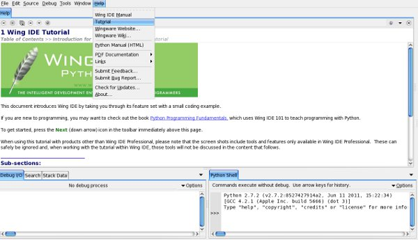
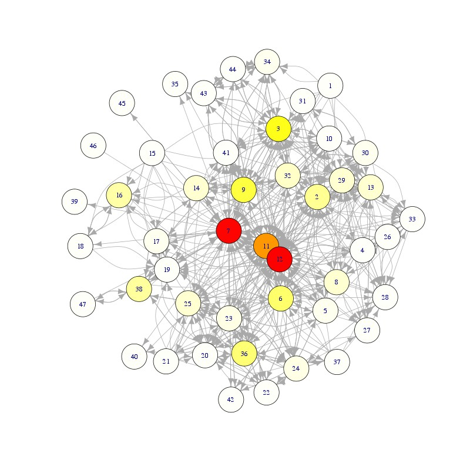
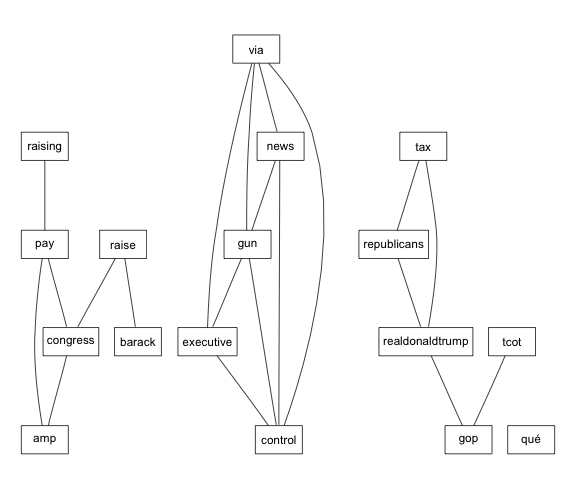

@:t ::t |:t \^:t -:t f:t \*:t TeX:t LaTeX:nil skip:nil d:t
tags:not-in-toc creator:nil

Goals
=====

-   Get a working python environment installed on your own computer
-   Make python seem less scary
-   Understand the basics of Twitter and how data can be obtained from
    Twitter
-   Give a sense of how to ask research questions using Twitter
-   Lay the groundwork so you can do further work on your own

A lot of what we're doing is covered in more detail in Matthew A.
Russel's book [Mining the Social
Web](http://www.amazon.com/Mining-Social-Web-Analyzing-Facebook/dp/1449388345).

Who am I?
---------

My name is Alex Storer, and I'm part of the [Research Technology
Consulting](http://dss.iq.harvard.edu) team at IQSS. I have a PhD in
Computational Neuroscience, and have done a lot of programming and
scripting to interact with data.

Our team can help you with your research questions, both with the
statistics and the technology. If you want to chat with us, simply
e-mail *support@help.hmdc.harvard.edu*.

What is this page?
------------------

This is a tutorial that I wrote using the org-mode in emacs. It is
hosted here:

<http://www.people.fas.harvard.edu/~astorer/twitter/>

You can always find details about our ongoing workshops here:

<http://dss.iq.harvard.edu>

The code for this workshop is posted here:

<https://github.com/alexstorer/twittersauce>

Basic Python
============

Python is a powerful interpreted language that people often use for
basic scripting. This is by no means a complete or thorough introduction
to Python! It's just enough to get by.

Installation
------------

Python comes in two modern flavors, version 2 and version 3. There are
some important language differences between them, and in practice,
almost everyone uses version 2. To install it, go
[here](http://python.org/download/) and select the relevant operating
system.

### IDE

An **IDE**, or Integrated Development Environment, is used to facilitate
programming. A good IDE does things like code highlighting, error
checking, one-click-running, and easy integration across multiple files.
An example of a crappy IDE is notepad. I like to use emacs. Most people
prefer something else.

### Wing IDE 101

For this session, I recommend [Wing
101](http://wingware.com/downloads/wingide-101). It's a free version of
a more fully-featured IDE, but for beginners, it's perfect. If you don't
already have an IDE that you're invested in, or you want your intro to
python to be as painless as possible, you should install it. It's cross
platform.

1.  Getting Started in Wing

    Once you have Wing installed, you might want to use the tutorial to
    learn how to navigate around in it.

    

Further Python Resources
------------------------

**But wait, I want to spend four months becoming a Python guru!**

Dude, you're awesome. Here are some resources that will help you:

-   [Python Programming
    Fundamentals](http://knuth.luther.edu/~leekent/IntroToComputing/)
    Uses WingIDE to teach basic computer science tactics using python
-   [Python Challenge](http://www.pythonchallenge.com/) A fun
    programming riddle that will increase your chops.
-   [Learn Python The Hard Way](http://learnpythonthehardway.org/) The
    Hard Way means by actually writing code. Maybe it should be called
    The Good Way?

Diving In
---------

In Wing, there is a window open called **Python Shell**

-   If you know **R**, think of this just like the R command line
-   If you've never programmed before, think of this as a graphing
    calculator

``` {.python}
print 2+4
```

``` {.example}
6
```

### Basic Text Handling

-   Of course, this graphing calculator can handle text, too!

``` {.python}
mystr = "Hello, World!"
print mystr
print len(mystr)
```

``` {.example}
Hello, World!
13
```

  ------------------------------- -------------------------------- -----------------------------------------------------------------------------------------------------------------------------------------------------
  **Python Code**                 **R Code**                       **English Translation**
  `print 2+4`                     `print(2+4)`                     Print the value of 2+4
  `` mystr = '`Hello World'` ``   `` mystr <- '`Hello World'` ``   Assign the string "Hello World" to the variable mystr
  `len(mystr)`                    `nchar(mystr)`                   How "long" is the variable mystr? *Note: R can tell you how long it is, but if you want the number of characters, that's what you need to ask for.*
                                                                   
  ------------------------------- -------------------------------- -----------------------------------------------------------------------------------------------------------------------------------------------------

**Note to Stata Users:**\
Assigning a variable is not the same as adding a "column" to your
dataset.

### Indexing and Slicing

Get the first element of a string.

-   **Note:** Python counts from 0. This is a common convention in most
    languages constructed by computer scientists.

``` {.python}
mystr = "Dogs in outer space"
print mystr[0]
```

``` {.example}
D
```

Get the last element of a string

``` {.python}
mystr = "Dogs in outer space"
print mystr[-1]
print mystr[len(mystr)-1]
```

``` {.example}
e
e
```

``` {.python}
mystr = "Dogs in outer space"
print mystr[1:3]
print mystr[3:]
print mystr[:-3]
```

``` {.example}
og
s in outer space
Dogs in outer sp
```

### Including Other Packages

-   By default, python doesn't include every possible "package"
    -   This is similar to R, but unlike Matlab
    -   Use the `include` statement to load a library

``` {.python}
import math
print math.sin(math.pi)
```

``` {.example}
1.22464679915e-16
```

After we import from a package, we have to access sub-elements of that
package using the `.` operator. Notice also that while the value
`1.22464679915e-16` is very nearly `0`, the `math` module doesn't know
that sin(*π*) = 0. There are smarter modules for doing math in Python,
like `scipy` and `numpy`. Some people love using Python for Math. I
think it makes more sense to use R.

-   If you want to `import` something into your namespace
    -   `from math import <myfunction>` **or**
    -   `from math import *`

``` {.python}
from math import *
print sin(pi)
```

``` {.example}
1.22464679915e-16
```

### Objects and methods

Python makes extensive use of **objects**. An object has

-   Methods: functions that work only on that option
-   Fields: data that only that type of object has

For example, let's imagine a `fruit` object. A `fruit` might have a
field called `hasPeel`, which tells you whether this fruit is peeled. It
could also have a method called `peel`, which alters the state of the
fruit.

``` {.python}
str = "THE World is A BIG and BEAUTIFUL place.  "
print str.upper()
name = "Alex Storer"
print name.swapcase()
```

``` {.example}
THE WORLD IS A BIG AND BEAUTIFUL PLACE.  
aLEX sTORER
```

Here we defined two strings, `str` and `name`, and used these to invoke
string methods which affect the case of the string.

-   You can write your own objects and methods
-   Objects can be sub-classes of other objects
    -   e.g., a `psychologist` is a type of `researcher`, who does
        everything a `researcher` does but also some other things only a
        `pyschologist` does.

### Defining Functions

You can write your own functions, pieces of code that can be used to
take specific inputs and give outputs. You can create a function by
using the `def` command.

``` {.python}
def square(x):
    return x*x
print square(9)
```

``` {.example}
81
```

Pay close attention to the **whitespace** that is used in Python! Unlike
other languages, it is not ignored. Everything with the same indentation
is in the same level. Above, the statement `return x*x` is part of the
`square` function, but the following line is outside of the function
definition.

### Logical Flow


You can think about this logical process as being in pseudocode.

``` {.example}
IF do things right
   ---> code well
OTHERWISE
   ---> do things fast
```

A lot of programming is figuring out how to fit things into this sort of
`if=/=else` structure. Let's look at an example in Python.

-   The method `find` returns the index of the first location of a
    string match

``` {.python}
mystr = "This is one cool looking string!"
if mystr.find("string")>len(mystr)/2:
    print "The word 'string' is in the second half"
else:
    print "The word 'string is not in the second half"
```

``` {.example}
The word 'string' is in the second half
```

What happens if the word "string" is not there at all?

-   The method `find` returns -1 if the string isn't found

``` {.python}
mystr = "I don't know about you, but I only use velcro."
print mystr.find("string")
if mystr.find("string")>len(mystr)/2:
    print "The word 'string' is in the second half"
elif mystr.find("string")>=0:
    print "The word 'string is not in the second half"
else:
    print "The word 'string' isn't there!"
```

``` {.example}
-1
The word 'string' isn't there!
```

-   **Important Note:** In Python, most everything evaluates to `True`.
    Exceptions include `0` and `None`. This means that you can say
    things like `if (result)` where the result may be a computation, a
    string search, or anything like that. As long as it evaluates to
    `True`, it will work!

### Review

-   `if`, `elif` and `else` can be used to control the flow of a program
-   strings are a type of a object, and have a number of methods that
    come with them, including `find`, `upper` and `swapcase`
    -   methods are called using `mystring.method()`
    -   The list of methods for strings can be found in the [Python
        documentation](http://docs.python.org/library/stdtypes.html)
-   `def` can be used to define a function
    -   The `return` statement determine what the function returns

For Loops
---------

The for loop is a major component of how python is used. You can iterate
over lots of different things, and python is smart enough to know how to
do it.

-   **Note:** the following is what's called pseudocode - something that
    looks like code, but isn't going to run. It's a helpful way to
    clarify the steps that you need to take to get things to work.

``` {.python}
for (item in container):
    process item
    print item
print "done processing items!"
```

Notice the use of the &lt;TAB&gt; (or spacing) - that's how python knows
whether we're inside the loop or not!

### Example

``` {.python}
str = "Daddy ran to help Ann.  Up and down went the seesaw."      
for word in str.split():
    print word
```

``` {.example}
Daddy
ran
to
help
Ann.
Up
and
down
went
the
seesaw.
```

Notice the use of `str.split()`: this is an example of calling a
*method* of a *string object*. It returns a **list** of words after
splitting the string on whitespace.

Lists
-----

-   A **list** is a data type that can hold anything.
-   Lists are iterable (you can pass them to a `for` loop
-   You can `.append`, `.extend`,and otherwise manipulate lists. [Python
    Documentation](http://docs.python.org/tutorial/datastructures.html)

``` {.python}
mylist = ['dogs',1,4,"fishes",["hearts","clovers"],list]  
for element in mylist:
    print element    
mylist.reverse()
print mylist
```

``` {.example}
dogs
1
4
fishes
['hearts', 'clovers']
<type 'list'>
[<type 'list'>, ['hearts', 'clovers'], 'fishes', 4, 1, 'dogs']
```

Exercise
--------

1.  Write a function that takes in a string, and outputs the square of
    its length.
2.  Write a function that returns the number of capitalized letters in a
    string. *Hint: try using `lower` and the == operator*
3.  Write a function that returns everything in a string up to "dog",
    and returns "not found" if the string is not present.

### Exercise Solutions

1.  Exercise 1:

    Write a function that takes in a string, and outputs the square of
    its length.

    Notice that a function can call another function that you wrote.

    ``` {.python}
    def square(x):
        return x*x

    def sqlen(x):
        return square(len(x))

    print sqlen("Feet")
    ```

    ``` {.example}
    16
    ```

2.  Exercise 2

    Write a function that returns the number of capitalized letters in a
    string.

    ``` {.python}
    def numcaps(x):
        lowerstr = x.lower()
        ncaps = 0
        for i in range(len(x)):
            if lowerstr[i]!=x[i]:
                ncaps += 1
        return ncaps

    teststr = "Dogs and Cats are both Animals"
    print teststr, "has", str(numcaps(teststr)), "capital letters"
    ```

    ``` {.example}
    Dogs and Cats are both Animals has 3 capital letters
    ```

3.  Exercise 3

    ``` {.python}
    def findDog(x):
        mylist = x.split("dog")
        if len(mylist) < 2:
            return "not found"
        else:
            return mylist[0]    
        return mylist
    print findDog("i have a dog but not a cat")
    print findDog("i have a fish but not a cat")
    print findDog("i have a dog but not a dogwood")

    ```

    ``` {.example}
    i have a 
    not found
    i have a 
    ```

`dict` type
-----------

A `dict`, short for dictionary, is a helpful data structure in Python
for building mappings between inputs and outputs.


### Examples

``` {.python}
mydict = dict()
mydict["dogs"] = 14
mydict["fish"] = "slumberland"
mydict["dogs"]+= 3
print mydict
```

``` {.example}
mydict = dict()
mydict["dogs"] = 14
mydict["fish"] = "slumberland"
mydict["dogs"]+= 3
print mydict
{'fish': 'slumberland', 'dogs': 17}


```

``` {.python}
len(mydict["fish"])
```

One of the nice things about python is that even when very condensed, it
is still readable. People talk about coding in a pythonic way, meaning
to write very tight, readable code.

``` {.python}
print dict([(x, x**2) for x in (2, 4, 6)]) 
```

``` {.example}
{2: 4, 4: 16, 6: 36}
```

Let's use a dictionary to store word counts from a sentence.

``` {.python}
str = "Up and down went the seesaw. Up it went.  Down it went.  Up, up, up!"
print str
for i in [",",".","!"]:
    str = str.replace(i," ")
print str
str = str.lower()
print str
print set(str.lower().split())
```

``` {.example}
Up and down went the seesaw. Up it went.  Down it went.  Up, up, up!
Up and down went the seesaw  Up it went   Down it went   Up  up  up 
up and down went the seesaw  up it went   down it went   up  up  up 
set(['and', 'up', 'it', 'down', 'seesaw', 'went', 'the'])
```

We see that a `set` contains an unordered collection of the elements of
the list returned by `split()`. Let's make a dictionary with keys that
are pulled from this set.

``` {.python}
str = "Up and down went the seesaw. Up it went.  Down it went.  Up, up, up!"
for i in [",",".","!"]:
    str = str.replace(i," ")
words = str.lower().split()
d = dict.fromkeys(set(words),0)
print d
for w in words:
    d[w]+=1
print d
```

``` {.example}
{'and': 0, 'down': 0, 'seesaw': 0, 'went': 0, 'the': 0, 'up': 0, 'it': 0}
{'and': 1, 'down': 2, 'seesaw': 1, 'went': 3, 'the': 1, 'up': 5, 'it': 2}
```

### Writing to CSV

A very useful feature of dictionaries is that there is an easy method to
write them out to a CSV (comma-separated variable) file.

``` {.python .rundoc-block rundoc-language="python" rundoc-cache="yes"}
import csv
f = open('/tmp/blah.csv','w')
nums = [1,2,3]
c = csv.DictWriter(f,nums)
for i in range(0,10):
    c.writerow(dict([(x, x**i) for x in nums]))
f.close()
```

This writes out the following csv file:

``` {.example}
1,1,1
1,2,3
1,4,9
1,8,27
1,16,81
1,32,243
1,64,729
1,128,2187
1,256,6561
1,512,19683    
```

### A Note on File Objects

-   Think about file objects like a book
    -   If a file is open, you don't want other people to mess with it
    -   Files can be opened for reading or writing
    -   There are methods to move around an open file
-   Close the book when you're done reading it!
-   Python documentation on "File I/O" is
    [here](http://docs.python.org/tutorial/inputoutput.html)

  English                            Python                       Output
  ---------------------------------- ---------------------------- ---------------------------------
  /                                  &lt;                         &lt;
  Open `blah.txt` just for reading   `f = open('blah.txt','r')`   file object `f`
  Get the next line in a file        `str = f.readline()`         string containing a single line
  Get the entire file                `str = f.read()`             string containing entire file
  Go to the beginning of a file      `f.seek(0)`                  `None`
  Close `blah.txt`                   `f.close()`                  `None`

To play with this, download [this
file](http://www.people.fas.harvard.edu/~astorer/scraping/gaga.txt)
somewhere on your hard drive. I'm putting it on my hard drive as
`/tmp/gaga.txt`. On Windows, it may look more like `C:\temp\gaga.txt` -
just make sure you get the path correct when you tell Python where to
look!

``` {.python .rundoc-block rundoc-language="python" rundoc-cache="yes"}
# On a mac:
#curl http://www.people.fas.harvard.edu/~astorer/scraping/gaga.txt > /tmp/gaga.txt
f = open('/tmp/gaga.txt','r')
print f
str = f.read()
print "str has length: ", len(str)
str2 = f.read()
print "str2 has length: ", len(str2)
f.seek(0)
str3 = f.readline()
print "str3 has length: ", len(str3)
f.close()
```

``` {.example}
<open file '/tmp/gaga.txt', mode 'r' at 0x10045ef60>
str has length:  1220
str2 has length:  0
str3 has length:  77
```

You'll use file objects *a lot*. As we see them, I'll try to point out
what's important about them.

### Exercise {#exercise-4}

1.  Exercise 1

    Write a function that counts the number of unique letters in a word.

2.  Exercise 2

    Write a function that takes in a string, and returns a `dict` that
    tells you how many words of each number of letters there are.

    ``` {.example}
    "Dogs and cats are all animals"
     dogs and cats are al  animls
     4    3   4    3   2   6
     {2: 1, 3: 2, 4: 2, 6: 1}
    ```

3.  Exercise 3

    Loop over a list of strings, and write a csv that contains a column
    for each number and a row for each string.

    ``` {.example}
     1,2,3,4,5,6,7,8,9,10,11,12,13
     2,3,2,3,4,5,2,3,2,1 , 0, 0, 0
     5,2,1,0,1,2,0,0,0,0 , 0, 0, 0
     etc.
    ```

### Exercise Solutions

1.  Exercise 1

    Write a function that counts the number of unique letters in a word.

    ``` {.python .rundoc-block rundoc-language="python" rundoc-cache="yes"}
    def uniqueletters(w):
        d = dict()
        for char in w:
            d[char] = 1
        return len(d.keys())
    print uniqueletters("dog")
    print uniqueletters("dogged")

    ```

    ``` {.example}
    3
    4
    ```

2.  Exercise 2

    Write a function that takes in a string, and returns a `dict` that
    tells you how many words of each number of letters there are.

    ``` {.example}
    "Dogs and cats are all animals"
     dogs and cats are al  animls
     4    3   4    3   2   6
     {2: 1, 3: 2, 4: 2, 6: 1}
    ```

    ``` {.python}
    def uniqueletters(w):
        d = dict()
        for char in w:
            d[char] = 1
        return len(d.keys())

    def wordcounter(str):
        d = dict()
        for w in str.split():
            u = uniqueletters(w)
            if u in d.keys():           
                d[u]+=1
            else:
                d[u] = 1
        return d

    print wordcounter("Dogs and cats are all animals")

    ```

    ``` {.example}
    {2: 1, 3: 2, 4: 2, 6: 1}
    ```

3.  Exercise 3

    Loop over a list of strings, and write a csv that contains a column
    for each number and a row for each string.

    ``` {.example}
     1,2,3,4,5,6,7,8,9,10,11,12,13
     2,3,2,3,4,5,2,3,2,1 , 0, 0, 0
     5,2,1,0,1,2,0,0,0,0 , 0, 0, 0
     etc.
    ```

    ``` {.python .rundoc-block rundoc-language="python" rundoc-cache="no"}
    import csv
    def uniqueletters(w):
        d = dict()
        for char in w:
            d[char] = 1
        return len(d.keys())

    def wordcounter(str):
        d = dict()
        for w in str.split():
            u = uniqueletters(w)
            if u in d.keys():           
                d[u]+=1
            else:
                d[u] = 1
        return d

    def listwriter(l):
        emptydict = dict([(x, 0) for x in range(1,26)])
        f = open('/tmp/blah.csv','w')
        c = csv.DictWriter(f,sorted(emptydict.keys())) 
        c.writeheader()    
        for str in l:
            c.writerow(dict(emptydict.items()+wordcounter(str).items()))
        f.close()

    listwriter(["Five score years ago, a great American, in whose symbolic shadow we stand today, signed the Emancipation Proclamation.",
                "We observe today not a victory of party, but a celebration of freedom -- symbolizing an end, as well as a beginning -- signifying renewal, as well as change.", 
                "So, first of all, let me assert my firm belief that the only thing we have to fear is fear itself -- nameless, unreasoning, unjustified terror which paralyzes needed efforts to convert retreat into advance."])

    ```

    Here is the resulting CSV file:

Aspects of Twitter
==================

Anatomy of a Tweet
------------------

### This is a tweet

``` {.example}
RT @AlbertBreer: Gronkowski had screws inserted in his forearm at
MGH this AM. He'll want to play during that Texans-Niners
turn. That'd be awfully quick.
```

-   `RT`: Retweet
-   `@AlbertBreer`: A twitter user starts with @
-   Max characters: 140

### More information

``` {.example}
[{"created_at":"Mon, 19 Nov 2012 20:19:21 +0000",
  "from_user":"theemarkweber",
  "from_user_id":214343936,
  "from_user_id_str":"214343936",
  "from_user_name":"Mark Weber",
  "geo":null,
  "id":270622312510939137,
  "id_str":"270622312510939137",
  "iso_language_code":"en",
  "metadata":{"result_type":"recent"},
  "profile_image_url":"http:\/\/a0.twimg.com\/profile_images\/2597471289\/d0ll7w5wu5dra272h3jn_normal.jpeg",
  "profile_image_url_https":"https:\/\/si0.twimg.com\/profile_images\/2597471289\/d0ll7w5wu5dra272h3jn_normal.jpeg",
  "source":"&lt;a href=&quot;http:\/\/twitter.com\/download\/iphone&quot;&gt;Twitter for iPhone&lt;\/a&gt;",
  "text":"RT @AlbertBreer: Gronkowski had screws inserted in his forearm at MGH this AM. He'll want to play during that Texans-Niners turn. That'd be awfully quick.",
  "to_user":null,
  "to_user_id":0,
  "to_user_id_str":"0",
  "to_user_name":null}]
```

-   This is the available information in a tweet that can be obtained
    from twitter

Anatomy of a Twitter User
-------------------------

Users of twitter have a lot of data about them in addition to just their
tweets!

Notice:

-   The language of the user
-   The location of the user
-   Also we can get:
    -   Followers/Friends
    -   Recent tweets
    -   Favorite tweets
    -   etc.

``` {.example}
==> statuses_count :
28
==> profile_background_color :
C0DEED
==> friends_count :
36
==> profile_link_color :
0084B4
==> profile_image_url :
http://a0.twimg.com/profile_images/1896597694/iqssrtc_normal.jpg
==> notifications :
False
==> profile_background_image_url_https :
https://si0.twimg.com/images/themes/theme1/bg.png
==> profile_background_image_url :
http://a0.twimg.com/images/themes/theme1/bg.png
==> name :
Research Consulting
==> lang :
en
==> profile_background_tile :
False
==> favourites_count :
0
==> screen_name :
iqssrtc
==> url :
http://dss.iq.harvard.edu
==> created_at :
Wed Mar 14 14:09:08 +0000 2012
==> contributors_enabled :
False
==> location :
Cambridge, MA
==> profile_sidebar_border_color :
C0DEED
==> default_profile :
True
==> following :
False
```

How Twitter has changed
-----------------------

-   Geocoding
-   Use over time

      Date              Tweets (millions/day)
      ----------------- -----------------------
      October, 2012     500
      June, 2012        400
      March, 2012       340
      October, 2011     250
      September, 2010   90
      February, 2010    50
      November, 2009    27
      December, 2008    2
      2008              0.3
      2007              0.005
      March, 2006       0.000001

-   How much data is this?

500,000,000 \* (\~ 5kb) = 23.2831 GB

APIs
----

-   "Application Programming Interface"
-   Ways to interface with an application through a program
    -   Think about how a site like Yelp can embed Google Maps rather
        than linking to it

### Twitter API

-   Latest version: 1.1, Released August 2012
-   Will not be the same in 5 years!
-   List of everything you can do:
    -   <https://dev.twitter.com/docs/api/1.1>
    -   Examples:
        -   Get all posts about Sarah Palin before October 2008
            -   (*this is actually no longer possible*)
        -   Get all posts about Hurricane Katrina in the Houston area

### Limitations of Twitter API

-   For some uses, you need an application
-   Extensive **rate limiting**
-   Not everything collected by Twitter is exposed by the API

### JSON and API searches

<http://search.twitter.com/search.json?q=gronkowski>

``` {.javascript .rundoc-block rundoc-language="javascript" rundoc-eval="no"}
{"completed_in":0.011,
 "max_id":293883536627363840,
 "max_id_str":"293883536627363840",
 "next_page":"?page=2&max_id=293883536627363840&q=gronkowski",
 "page":1,"query":"gronkowski",
 "refresh_url":"?since_id=293883536627363840&q=gronkowski",
 "results":[
     {"created_at":"Wed, 23 Jan 2013 00:51:09 +0000","from_user":"ezmoney3478","from_user_id":395745114,"from_user_id_str":"395745114","from_user_name":"Kevin Perich ","geo":null,"id":293883536627363840,"id_str":"293883536627363840","iso_language_code":"en","metadata":{"result_type":"recent"},"profile_image_url":"http:\/\/a0.twimg.com\/profile_images\/1761062514\/image_normal.jpg","profile_image_url_https":"https:\/\/si0.twimg.com\/profile_images\/1761062514\/image_normal.jpg","source":"&lt;a href=&quot;http:\/\/twitter.com\/download\/iphone&quot;&gt;Twitter for iPhone&lt;\/a&gt;","text":"RT @SmokinJC6: #LetsPretend that Rob Gronkowski wasn't a causal user of the drug cocaine","to_user":null,"to_user_id":0,"to_user_id_str":"0","to_user_name":null},
     {"created_at":"Wed, 23 Jan 2013 00:40:22 +0000","from_user":"OGKaufer","from_user_id":430404805,"from_user_id_str":"430404805","from_user_name":"Kevin K","geo":null,"id":293880819930509313,"id_str":"293880819930509313","iso_language_code":"en","metadata":{"result_type":"recent"},"profile_image_url":"http:\/\/a0.twimg.com\/profile_images\/2811609388\/eaa7866c9f50476811d0073e4ec2de55_normal.jpeg","profile_image_url_https":"https:\/\/si0.twimg.com\/profile_images\/2811609388\/eaa7866c9f50476811d0073e4ec2de55_normal.jpeg","source":"&lt;a href=&quot;http:\/\/twitter.com\/&quot;&gt;web&lt;\/a&gt;","text":"#Patriots are pussies. Only 1 of their pro bowl players are actually attending (other than Gronkowski) because the rest are \"out for injury\"","to_user":null,"to_user_id":0,"to_user_id_str":"0","to_user_name":null},
     {"created_at":"Wed, 23 Jan 2013 00:35:53 +0000","from_user":"WaceTragner","from_user_id":21977325,"from_user_id_str":"21977325","from_user_name":"Wacington D. Tragner","geo":null,"id":293879691796942848,"id_str":"293879691796942848","iso_language_code":"en","metadata":{"result_type":"recent"},"profile_image_url":"http:\/\/a0.twimg.com\/profile_images\/99260325\/n73400266_34070453_530_normal.jpg","profile_image_url_https":"https:\/\/si0.twimg.com\/profile_images\/99260325\/n73400266_34070453_530_normal.jpg","source":"&lt;a href=&quot;http:\/\/twitter.com\/download\/iphone&quot;&gt;Twitter for iPhone&lt;\/a&gt;","text":"@therealtwatto @KievGuy Brust looks like a mini Gronkowski, kinda","to_user":"therealtwatto","to_user_id":210318115,"to_user_id_str":"210318115","to_user_name":"Chris Thorpe"},
     {"created_at":"Wed, 23 Jan 2013 00:28:35 +0000","from_user":"lilahmy3","from_user_id":302811957,"from_user_id_str":"302811957","from_user_name":"Ahmad Munir","geo":null,"id":293877855107051520,"id_str":"293877855107051520","iso_language_code":"en","metadata":{"result_type":"recent"},"profile_image_url":"http:\/\/a0.twimg.com\/profile_images\/3040876646\/97e95fb7f82b597ba75e9502440bbaf2_normal.jpeg","profile_image_url_https":"https:\/\/si0.twimg.com\/profile_images\/3040876646\/97e95fb7f82b597ba75e9502440bbaf2_normal.jpeg","source":"&lt;a href=&quot;http:\/\/twitter.com\/download\/iphone&quot;&gt;Twitter for iPhone&lt;\/a&gt;","text":"@Salamiscot I'm jk they didn't cheat but it would've been a completely different game with Gronkowski and Talib in","to_user":"Salamiscot","to_user_id":92390272,"to_user_id_str":"92390272","to_user_name":"Scot Spears","in_reply_to_status_id":293871588774920192,"in_reply_to_status_id_str":"293871588774920192"},
     {"created_at":"Wed, 23 Jan 2013 00:26:11 +0000","from_user":"tadthebad","from_user_id":158559484,"from_user_id_str":"158559484","from_user_name":"Todd Everson","geo":null,"id":293877252939190273,"id_str":"293877252939190273","iso_language_code":"de","metadata":{"result_type":"recent"},"profile_image_url":"http:\/\/a0.twimg.com\/profile_images\/2272199020\/klk091tjn4ch9sj79nas_normal.jpeg","profile_image_url_https":"https:\/\/si0.twimg.com\/profile_images\/2272199020\/klk091tjn4ch9sj79nas_normal.jpeg","source":"&lt;a href=&quot;http:\/\/twitter.com\/#!\/download\/ipad&quot;&gt;Twitter for iPad&lt;\/a&gt;","text":"RT @DeeepThreat: @jerrythornton1 @PFF Gronkowski 148.2 target (passer) rating. Woodhead 120.7, Edelman 118.6, Welker 96.6","to_user":null,"to_user_id":0,"to_user_id_str":"0","to_user_name":null,"in_reply_to_status_id":293821205654425600,"in_reply_to_status_id_str":"293821205654425600"},
     {"created_at":"Wed, 23 Jan 2013 00:22:14 +0000","from_user":"__DaGAWD","from_user_id":282815887,"from_user_id_str":"282815887","from_user_name":"Thug God Ass Nigga","geo":null,"id":293876256557117440,"id_str":"293876256557117440","iso_language_code":"en","metadata":{"result_type":"recent"},"profile_image_url":"http:\/\/a0.twimg.com\/profile_images\/2990761885\/64c285f33c7ebde005b4ed2e318b7a5a_normal.jpeg","profile_image_url_https":"https:\/\/si0.twimg.com\/profile_images\/2990761885\/64c285f33c7ebde005b4ed2e318b7a5a_normal.jpeg","source":"&lt;a href=&quot;http:\/\/twitter.com\/&quot;&gt;web&lt;\/a&gt;","text":"My real name is Gronkowski","to_user":null,"to_user_id":0,"to_user_id_str":"0","to_user_name":null},
     {"created_at":"Wed, 23 Jan 2013 00:15:49 +0000","from_user":"Y2Jheard","from_user_id":42330140,"from_user_id_str":"42330140","from_user_name":"Jordan Heard","geo":{"coordinates":[31.389764,-102.350542],"type":"Point"},"id":293874643008356352,"id_str":"293874643008356352","iso_language_code":"de","metadata":{"result_type":"recent"},"profile_image_url":"http:\/\/a0.twimg.com\/profile_images\/3131311082\/566992c884977a9c4c023be353397786_normal.jpeg","profile_image_url_https":"https:\/\/si0.twimg.com\/profile_images\/3131311082\/566992c884977a9c4c023be353397786_normal.jpeg","source":"&lt;a href=&quot;http:\/\/twitter.com\/download\/iphone&quot;&gt;Twitter for iPhone&lt;\/a&gt;","text":"@espn @Y2Jheard: Rob Gronkowski, Javale McGee aaannnndddd Metta World Peace #AthleteDinner","to_user":"espn","to_user_id":2557521,"to_user_id_str":"2557521","to_user_name":"ESPN","in_reply_to_status_id":293799955162869760,"in_reply_to_status_id_str":"293799955162869760"},
     {"created_at":"Wed, 23 Jan 2013 00:11:00 +0000","from_user":"Y2Jheard","from_user_id":42330140,"from_user_id_str":"42330140","from_user_name":"Jordan Heard","geo":{"coordinates":[31.389699,-102.350473],"type":"Point"},"id":293873432096022528,"id_str":"293873432096022528","iso_language_code":"de","metadata":{"result_type":"recent"},"profile_image_url":"http:\/\/a0.twimg.com\/profile_images\/3131311082\/566992c884977a9c4c023be353397786_normal.jpeg","profile_image_url_https":"https:\/\/si0.twimg.com\/profile_images\/3131311082\/566992c884977a9c4c023be353397786_normal.jpeg","source":"&lt;a href=&quot;http:\/\/twitter.com\/download\/iphone&quot;&gt;Twitter for iPhone&lt;\/a&gt;","text":"Rob Gronkowski, Javale McGee aaannnndddd Metta World Peace #AthleteDinner","to_user":null,"to_user_id":0,"to_user_id_str":"0","to_user_name":null},
     {"created_at":"Wed, 23 Jan 2013 00:08:24 +0000","from_user":"steveh603","from_user_id":116954234,"from_user_id_str":"116954234","from_user_name":"Steve H","geo":null,"id":293872776010420224,"id_str":"293872776010420224","iso_language_code":"de","metadata":{"result_type":"recent"},"profile_image_url":"http:\/\/a0.twimg.com\/profile_images\/2213638557\/Steve_Jordan_normal.jpg","profile_image_url_https":"https:\/\/si0.twimg.com\/profile_images\/2213638557\/Steve_Jordan_normal.jpg","source":"&lt;a href=&quot;http:\/\/www.tweetcaster.com&quot;&gt;TweetCaster for Android&lt;\/a&gt;","text":"RT @DeeepThreat: @jerrythornton1 @PFF Gronkowski 148.2 target (passer) rating. Woodhead 120.7, Edelman 118.6, Welker 96.6","to_user":null,"to_user_id":0,"to_user_id_str":"0","to_user_name":null,"in_reply_to_status_id":293821205654425600,"in_reply_to_status_id_str":"293821205654425600"},{"created_at":"Wed, 23 Jan 2013 00:02:02 +0000","from_user":"jerrythornton1","from_user_id":133478732,"from_user_id_str":"133478732","from_user_name":"Jerry Thornton","geo":null,"id":293871175858286592,"id_str":"293871175858286592","iso_language_code":"de","metadata":{"result_type":"recent"},"profile_image_url":"http:\/\/a0.twimg.com\/profile_images\/2827357839\/4e0775a362decf96ff7fdcb044253381_normal.jpeg","profile_image_url_https":"https:\/\/si0.twimg.com\/profile_images\/2827357839\/4e0775a362decf96ff7fdcb044253381_normal.jpeg","source":"&lt;a href=&quot;http:\/\/twitter.com\/download\/iphone&quot;&gt;Twitter for iPhone&lt;\/a&gt;","text":"RT @DeeepThreat: @jerrythornton1 @PFF Gronkowski 148.2 target (passer) rating. Woodhead 120.7, Edelman 118.6, Welker 96.6","to_user":null,"to_user_id":0,"to_user_id_str":"0","to_user_name":null,"in_reply_to_status_id":293821205654425600,"in_reply_to_status_id_str":"293821205654425600"},
     {"created_at":"Tue, 22 Jan 2013 23:59:24 +0000","from_user":"vicremsen","from_user_id":308991877,"from_user_id_str":"308991877","from_user_name":"Victoria Remsen","geo":null,"id":293870511568584705,"id_str":"293870511568584705","iso_language_code":"en","metadata":{"result_type":"recent"},"profile_image_url":"http:\/\/a0.twimg.com\/profile_images\/2834030794\/224375576882a971ae1e557da3251095_normal.jpeg","profile_image_url_https":"https:\/\/si0.twimg.com\/profile_images\/2834030794\/224375576882a971ae1e557da3251095_normal.jpeg","source":"&lt;a href=&quot;http:\/\/twitter.com\/download\/iphone&quot;&gt;Twitter for iPhone&lt;\/a&gt;","text":"Awkward how my last two photos on Instagram are of Rob Gronkowski...","to_user":null,"to_user_id":0,"to_user_id_str":"0","to_user_name":null},
     {"created_at":"Tue, 22 Jan 2013 23:35:55 +0000","from_user":"_Balls_Deep_","from_user_id":325291577,"from_user_id_str":"325291577","from_user_name":"John Juan Twan","geo":null,"id":293864602209513472,"id_str":"293864602209513472","iso_language_code":"en","metadata":{"result_type":"recent"},"profile_image_url":"http:\/\/a0.twimg.com\/profile_images\/3065358642\/453fb17d20a2ec66e3d01bcbbe89fe22_normal.jpeg","profile_image_url_https":"https:\/\/si0.twimg.com\/profile_images\/3065358642\/453fb17d20a2ec66e3d01bcbbe89fe22_normal.jpeg","source":"&lt;a href=&quot;http:\/\/twitter.com\/&quot;&gt;web&lt;\/a&gt;","text":"What family would u rather be apart of? The Gronkowski's, Jones', Mannings, or Harbaughs?","to_user":null,"to_user_id":0,"to_user_id_str":"0","to_user_name":null},
     {"created_at":"Tue, 22 Jan 2013 23:21:27 +0000","from_user":"Big450","from_user_id":283788796,"from_user_id_str":"283788796","from_user_name":"Gary L Johnson","geo":null,"id":293860961956290560,"id_str":"293860961956290560","iso_language_code":"en","metadata":{"result_type":"recent"},"profile_image_url":"http:\/\/a0.twimg.com\/profile_images\/2447209594\/2WtVfb8u_normal","profile_image_url_https":"https:\/\/si0.twimg.com\/profile_images\/2447209594\/2WtVfb8u_normal","source":"&lt;a href=&quot;http:\/\/www.ea.com\/madden\/&quot;&gt;Madden NFL 13&lt;\/a&gt;","text":"RT @RossTuckerEA Nearly anybody and everybody can be traded. #R. Gronkowski #rumormill #CCM","to_user":null,"to_user_id":0,"to_user_id_str":"0","to_user_name":null},
     {"created_at":"Tue, 22 Jan 2013 23:20:03 +0000","from_user":"IQFB","from_user_id":65704807,"from_user_id_str":"65704807","from_user_name":"Football Trivia","geo":null,"id":293860609580204034,"id_str":"293860609580204034","iso_language_code":"en","metadata":{"result_type":"recent"},"profile_image_url":"http:\/\/a0.twimg.com\/profile_images\/362753783\/iqfblogo_normal.jpg","profile_image_url_https":"https:\/\/si0.twimg.com\/profile_images\/362753783\/iqfblogo_normal.jpg","source":"&lt;a href=&quot;http:\/\/twuffer.com&quot;&gt;Twuffer&lt;\/a&gt;","text":"FREE DOWNLOAD: The Ultimate Rob Gronkowski Fun Fact And Trivia Book! #NewEnglandPatriots #RobGronkowski #Gronk http:\/\/t.co\/GHCecwiQ","to_user":null,"to_user_id":0,"to_user_id_str":"0","to_user_name":null},
     {"created_at":"Tue, 22 Jan 2013 23:07:41 +0000","from_user":"Chef_Yerardi","from_user_id":847930274,"from_user_id_str":"847930274","from_user_name":"Matt Yerardi ","geo":null,"id":293857496542633984,"id_str":"293857496542633984","iso_language_code":"en","metadata":{"result_type":"recent"},"profile_image_url":"http:\/\/a0.twimg.com\/profile_images\/3057796741\/808d3fea71bb74235260fb92484c68b0_normal.jpeg","profile_image_url_https":"https:\/\/si0.twimg.com\/profile_images\/3057796741\/808d3fea71bb74235260fb92484c68b0_normal.jpeg","source":"&lt;a href=&quot;http:\/\/twitter.com\/download\/android&quot;&gt;Twitter for Android&lt;\/a&gt;","text":"Bernard Pollard would be the one to say that Brady should be punished for his slide, after he injured Brady, Welker, and Gronkowski.","to_user":null,"to_user_id":0,"to_user_id_str":"0","to_user_name":null}],
"results_per_page":15,"since_id":0,"since_id_str":"0"}
```

Some points of the API are exposed, like the search API.

The searches are returned as a **JSON**: JavaScript Object Notation

This is a concise and common way of bundling data

**Python**: <http://docs.python.org/2/library/json.html> **R**:
<http://cran.r-project.org/web/packages/rjson/index.html>

We are going to use the `twitter` package in python, but any package
that knows how to pull the JSON from twitter will have the same result.

Getting Data
============

Getting Started on Twitter
--------------------------

-   If you don't have a Twitter account, make one!
    -   You'll probably be much more successful at analyzing Twitter
        data if you're also using the service!
-   To be able use the API, you need to have an application.
-   Go to <https://dev.twitter.com/apps/new>

### Getting set-up in Python

-   Install `twitter` package for python:
-   From the command line, run:

``` {.example}
pip install twitter
```

or, if you prefer `easy_install`

``` {.example}
easy_install twitter
```

If you haven't done this before, it may be tricky! Do you have different
versions of Python installed?

### API Limitations

-   You need to log in (using the OAuth protocol)
    -   Your application gets a number of API calls per user
    -   Example: You add a "Tweet" function to your e-reader so you can
        tweet your current location
-   API calls are limited by function (e.g., if you max out on posting
    Tweets, you can still perform searches)
-   There is a different API for streaming tweets
-   If you break the rules, your application will be *blacklisted!*
-   Your API calls reset after 15 minutes
    -   When you get data, you will want to make sure you have code that
        can handle errors, check your rates and so forth

### Handling Limitations

-   You will need to save your data as you go

Options:

-   Put things into a database
-   Save your state in Python using "Pickles"
-   Convert things to the format you need as you go

### The "OAuth Dance"

An important part of getting data from Twitter is logging in. Before
getting user data from twitter, you **must** be logged in as a twitter
user. There are different strategies that have been used in the past for
authentication.

1.  Authenticating the wrong way

    The wrong way to authenticate:

    ``` {.example}
    username = "alex"
    password = "Ekfo))39l4**wlp..x"
    login(username,password)
    ```

    Your password is human readable! **Bad!**

    You're going to send it unencrypted over your network? **Bad!**

2.  Authenticating the right way

    A better way to authenticate:

    1.  Say "please authenticate me"
    2.  Get directed to the Twitter website
    3.  Enter your user name and password
    4.  Save a token on your computer that says you're legit

3.  How to login

    Stolen from <https://github.com/ptwobrussell/Mining-the-Social-Web>

    ``` {.python .rundoc-block rundoc-language="python" rundoc-eval="no"}
    import os
    import twitter

    from twitter.oauth import write_token_file, read_token_file
    from twitter.oauth_dance import oauth_dance


    def login():

        # Go to http://twitter.com/apps/new to create an app and get these items
        # See also http://dev.twitter.com/pages/oauth_single_token

        APP_NAME = ''
        CONSUMER_KEY = ''
        CONSUMER_SECRET = ''
        TOKEN_FILE = 'out/twitter.oauth'

        try:
            (oauth_token, oauth_token_secret) = read_token_file(TOKEN_FILE)
        except IOError, e:
            (oauth_token, oauth_token_secret) = oauth_dance(APP_NAME, CONSUMER_KEY,
                    CONSUMER_SECRET)

            if not os.path.isdir('out'):
                os.mkdir('out')

            write_token_file(TOKEN_FILE, oauth_token, oauth_token_secret)

        return twitter.Twitter(domain='api.twitter.com', api_version='1.1',
                            auth=twitter.oauth.OAuth(oauth_token, oauth_token_secret,
                            CONSUMER_KEY, CONSUMER_SECRET))

    ```

4.  Python import statements

    ``` {.python .rundoc-block rundoc-language="python" rundoc-eval="no"}
    import os
    import twitter

    from twitter.oauth import write_token_file, read_token_file
    from twitter.oauth_dance import oauth_dance
    ```

    We are using code from the `twitter` package

5.  Application name

    ``` {.python .rundoc-block rundoc-language="python" rundoc-eval="no"}
    APP_NAME = ''
    CONSUMER_KEY = ''
    CONSUMER_SECRET = ''
    TOKEN_FILE = 'out/twitter.oauth'
    ```

    -   We're going to copy our consumer key from our app
    -   <https://dev.twitter.com/apps>

6.  Returning our twitter object

    ``` {.python .rundoc-block rundoc-language="python" rundoc-eval="no"}
    try:
        (oauth_token, oauth_token_secret) = read_token_file(TOKEN_FILE)
    except IOError, e:
        (oauth_token, oauth_token_secret) = oauth_dance(APP_NAME, CONSUMER_KEY,
                CONSUMER_SECRET)

        if not os.path.isdir('out'):
            os.mkdir('out')

        write_token_file(TOKEN_FILE, oauth_token, oauth_token_secret)

    return twitter.Twitter(domain='api.twitter.com', api_version='1.1',
                        auth=twitter.oauth.OAuth(oauth_token, oauth_token_secret,
                        CONSUMER_KEY, CONSUMER_SECRET))
    ```

    -   `try` / `except` is a programming structure that attempts
        something, and does something if there's an error (rather than
        crashing your program)
    -   We will write the "token" to a file so we don't have to log in
        every time we need to do something
    -   We return a twitter object, which we will use to make API calls
    -   **Note:** We are using API Version 1.1 - the code on github uses
        only version 1

7.  What a login looks like

    Save the modified file as `twitter__login.py`

    ``` {.python .rundoc-block rundoc-language="python" rundoc-noexport="yes" rundoc-eval="no"}
    import twitter__login
    t = twitter__login.login()
    ```

    ``` {.example}
    >>> t = twitter__login.login()
    Hi there! We're gonna get you all set up to use .

    In the web browser window that opens please choose to Allow
    access. Copy the PIN number that appears on the next page and paste or
    type it here:

    Opening: http://api.twitter.com/oauth/authorize?oauth_token=XXXXXXXXXXXXXXXX

    Please enter the PIN: XXXXXXXX
    ```

### Our first API Call

``` {.python .rundoc-block rundoc-language="python" rundoc-eval="no"}
import twitter__login
t = twitter__login.login()
response = t.users.show(screen_name='iqssrtc')
```

-   Response here is a `WrappedTwitterResponse` object, basically a
    dictionary.

``` {.python .rundoc-block rundoc-language="python" rundoc-noexport="yes"}
response.keys()
```

``` {.example}
[u'follow_request_sent', u'profile_use_background_image', u'time_zone', u'id', u'description', u'verified', u'entities', u'profile_image_url_https', u'profile_sidebar_fill_color', u'is_translator', u'geo_enabled', u'profile_text_color', u'followers_count', u'protected', u'id_str', u'default_profile_image', u'listed_count', u'status', u'utc_offset', u'statuses_count', u'profile_background_color', u'friends_count', u'profile_link_color', u'profile_image_url', u'notifications', u'profile_background_image_url_https', u'profile_background_image_url', u'name', u'lang', u'profile_background_tile', u'favourites_count', u'screen_name', u'url', u'created_at', u'contributors_enabled', u'location', u'profile_sidebar_border_color', u'default_profile', u'following']
```

-   This is the collection of elements contained in the response
-   To query them, treat it like a dict object

``` {.python .rundoc-block rundoc-language="python" rundoc-noexport="yes"}
response['location']
```

``` {.example}
u'Cambridge, MA'
```

Search API
----------

> Please note that Twitter's search service and, by extension, the
> Search API is not meant to be an exhaustive source of Tweets. Not all
> Tweets will be indexed or made available via the search interface.

The search API is still useful primarily for getting recent events.

If you need older tweets, the API provides them by way of querying a
specific user.

You can also try using the older API version (until it is taken down)

Due to time constraints, we are going to focus instead on the streaming
API. Detailed searches on historical twitter data must be obtained from
a third-party provided at considerable cost.

### Search API Usage

``` {.python .rundoc-block rundoc-language="python" rundoc-eval="no"}
import twitter
import twitter__login

t = twitter__login.login()
boston_res = t.search.tweets(q="patriots",geocode="42.350425,-71.026611,50mi",count=100)
baltimore_res = t.search.tweets(q="patriots",geocode="39.291797,-76.59668,50mi",count=100)
```

**Goal**: Evaluate whether tweets about the patriots are different in
New England than in Baltimore.

  Option    Meaning
  --------- --------------------------------------------
  q         The query itself
  geocode   The location of the tweets: "lat,lon,\#mi"
  count     Results per page

**Full Documentation**:
<https://dev.twitter.com/docs/api/1.1/get/search/tweets>

### Gnip and other services

Twitter has partnered with other services to enable access to historical
tweets. Each of these services has their own API and their own structure
for handling rate limits, fees, etc.

Streaming API
-------------

-   A continuous feed of twitter data
-   Can be filtered by:
    -   Location
    -   Content
    -   User

> The default access level allows up to 400 track keywords, 5,000 follow
> userids and 25 0.1-360 degree location boxes. If you need elevated
> access to the Streaming API, you should explore our partner providers
> of Twitter data here.

### Real-time search for "Obama"

``` {.python .rundoc-block rundoc-language="python" rundoc-eval="no"}
twitter_stream = twitter.TwitterStream(auth=UserPassAuth('iqssrtc', '*********'))
res = twitter_stream.statuses.filter(track='obama')
```

Wait, didn't you just say that this is a bad way to do authentication?

Yes, it is. You can make a dummy account just for this purpose. Or, you
can modifiy the OAuth code from above to work here.

``` {.python .rundoc-block rundoc-language="python" rundoc-eval="no"}
reslist = []

tweetfields = set()

for r in res:
    if len(reslist)<5000:
        print len(reslist)
        reslist.append(r)
        tweetfields = tweetfields.union(r.keys())
    else:
        break
```

Each tweet has some metadata. We are going to keep a list of all the
tweets (`reslist`) and then keep a running union of the metadata fields.

We stop when we reach 5000 tweets - we could keep going as long as we
have patientce and resources.

``` {.python .rundoc-block rundoc-language="python" rundoc-eval="no"}
fname = '/users/astorer/Work/presentations/twitter/example_tweets.csv'
f = open(fname,'w')
dw = csv.DictWriter(f,fieldnames=list(tweetfields))
dw.writeheader()

for r in reslist:
    dw.writerow({k:v.encode('utf8') if isinstance(v,unicode) else v for k,v in r.items()})    
f.close()
```

We then write out (in unicode) each of the tweet fields to a single csv
file.

User graphs
-----------



**Circles**
:   Twitter users

**Lines**
:   Who follows/is followed by (notice the arrows)

**Color**
:   [Betweenness
    Centrality](http://en.wikipedia.org/wiki/Betweenness_centrality) -
    how well connected is a node (in terms of shortest paths)

------------------------------------------------------------------------

-   Twitter uses them to figure out
    -   "Who to Follow"
    -   "Similar to”
    -   Search relevance
-   Social Scientists have used Network Analysis to
    -   Determine whether isolation radicalizes Muslim clerics
    -   Evaluate health impacts of your social network
    -   Model the spread of information

### Basic Idea

**Basic Idea**: Use Python to make API calls and process the results

``` {.python .rundoc-block rundoc-language="python" rundoc-cache="t"}
f0_in = t.followers.ids(screen_name='iqssrtc')
```

``` {.example}
{u'next_cursor_str': u'0', u'previous_cursor': 0, u'ids': [1016821495, 29354944, 56276556, 39276767, 41861503, 174223715, 16582606, 63513095, 1740171, 35323, 903628728, 18326200, 605934790, 320994155, 700975202, 603889619, 3319021, 202968305, 89079680, 109303284, 15344819, 140491706, 263947795, 223353896, 365653829, 39281968, 562122275, 81859001, 158494157, 108660744, 312791445, 7019992, 299894471], u'next_cursor': 0, u'previous_cursor_str': u'0'}
```

**Cursor**
:   Tells us where we are in the list of reponses (if we have &gt;5000
    responses)

**IDs**
:   Tells us the list of followers in this batch

### Overview: The Details

-   We can only ask for the followers 15 times in 15 minutes.
    -   We have to remember where we were
    -   We have to wait 15 minutes before trying more
    -   We have to save our progress in case anything goes wrong
    -   We have to have plenty of error handling (try/except)
-   Imagine that we have a **database** of users and their data
    -   Before downloading, first check the database
    -   If not in the database, then collect the data spending an API
        call
-   Goal: maximum simplicity
    -   Use a `dict` in python to store everything
        -   keyed by the user ID
    -   Write it to disk as a JSON
    -   **Note**: If you're trying to store huge amounts of information,
        this is the wrong way to do it

### Getting a user and all their friends and followers

``` {.python .rundoc-block rundoc-language="python" rundoc-eval="no"}
d[user_id_str]
```

`d` is a dictionary that will hold each user's information...in another
dictionary!

``` {.python .rundoc-block rundoc-language="python" rundoc-eval="no"}
d[user_id_str]["followers"]
```

This will be a list of this user's followers. We'll also have `friends`
(a list of people this user follows) and `details`, which will contain
the user's ID, screen name and other infomation provided by twitter.

``` {.python .rundoc-block rundoc-language="python" rundoc-eval="no"}
addUser(user_id,d,t)
```

We will write a function `addUser`, which will take a user id, the
dictionary that stores our data and the twitter call. We will assume
that this works, and plunge ahead!

------------------------------------------------------------------------

To get a user's entire network, we are going to call `addUser` on the
user, as well as all of their friends and followers:

``` {.python .rundoc-block rundoc-language="python" rundoc-eval="no"}
def crawlUser(user_id,d,t):
    addUser(user_id,d,t)
    user_id_str = str(user_id)    
    for uid in d[user_id_str]["followers"]:
        addUser(uid,d,t)
    for uid in d[user_id_str]["friends"]:
        addUser(uid,d,t)
```

Notice that `crawlUser` expects a numeric user ID, but the dictionary
stores mappings from keys. This is related to how we save our results as
we go.

### Getting a user

To get everything we need about a user, we will need to...

1.  Check if they are in the dictionary a. If so, do we have their
    "details"? b. If so, do we have their "followers"? c. If so, do we
    have their "friends"?
2.  If not, get their... a. "details" b. "followers" c. "friends"

We will also save periodically (after roughly 1 out of 10 users)

``` {.python .rundoc-block rundoc-language="python" rundoc-eval="no"}
def addUser(user_id,d,t):
    user_id_str = str(user_id)
    if user_id_str in d.keys():
        print "Already have user", user_id_str
        if "details" not in d[user_id_str].keys():
            d[user_id_str]["details"] = users_show(t,user_id=user_id)
        if "followers" not in d[user_id_str].keys():
            d[user_id_str]["followers"] = followers_ids(t,user_id=user_id)
        if "friends" not in d[user_id_str].keys():
            d[user_id_str]["friends"] = followers_ids(t,user_id=user_id)
    else:
        print "Downloading user", user_id_str        
        userd = dict()
        userd["details"] = users_show(t,user_id=user_id)
        userd["followers"] = followers_ids(t,user_id=user_id)
        userd["friends"] = friends_ids(t,user_id=user_id)
        d[user_id_str] = userd
    if random.random()>0.9:
        saveFile(d)
```

### Actually getting the information

We define wrapper functions for the calls to the Twitter API. For these
to work, we must call the Twitter functions, handle any errors that come
back, and remember our place for the Twitter functions that do not
return all of their information at once.

This is called using a "cursor":
<https://dev.twitter.com/docs/misc/cursoring>

In this function, we will handle both user id and screen name, although
it's easier to just use user ID, as that's what the twitter API calls
will all return.

The `next_cursor` is returned from the twitter API calls, so we can just
pass it to the next twitter API call if it indicates that there is more
data to collect.

The try/except framework lets us `try` a block of code, and if something
goes wrong, it will execute the `except` block.

We will have the specific twitter api errors handled by a separate
function.

``` {.python .rundoc-block rundoc-language="python" rundoc-eval="no"}
def followers_ids(t,user_id=None,screen_name=None,wait_period=2,cursor=-1):
    try:
        if user_id is not None:
            result = t.followers.ids(user_id=user_id,cursor=cursor)
        elif screen_name is not None:
            result = t.followers.ids(screen_name=screen_name,cursor=cursor)
    except twitter.api.TwitterHTTPError as e:
        wait_period = handleTwitterHTTPError(e, t, wait_period)
        if wait_period is not None:
            return followers_ids(t,user_id=user_id,screen_name=screen_name,wait_period=wait_period,cursor=cursor)
        else:
            return None            
    if result["next_cursor"] != 0:
        allids = result['ids']
        return allids+followers_ids(t,user_id=user_id,screen_name=screen_name,wait_period=wait_period,cursor=result["next_cursor"])
    else:
        return result['ids']
```

This is just for `followers_ids`, but we also will have one for
`friends_ids` and `users_show`. Remember, the full list of API calls is
available here:

<https://dev.twitter.com/docs/api/1.1>

### Error Handling

``` {.python .rundoc-block rundoc-language="python" rundoc-eval="no"}
def handleTwitterHTTPError(e, t, wait_period=2):
    if e.e.code == 401:
        print >> sys.stderr, 'Encountered 401 Error (Not Authorized)'
        return None        
    elif e.e.code in (502, 503):
        # these errors are Twitter's fault!
        print >> sys.stderr, 'Encountered %i Error. Will retry in %i seconds' % (e.e.code,
                wait_period)
        time.sleep(wait_period)
        wait_period *= 1.5
        return wait_period
    elif e.e.code == 429:
        # you are being rate limited
        print 'Rate limiting.'
        timer15()
        return wait_period
    else:
        raise e
```

The basic idea is that we will either be blocked from viewing someone's
information, twitter will have some "fail whale" type error, or we will
be rate limited.

**Rate Limiting**
:   Wait 15 minutes, then try again

**Fail Whale**
:   Wait longer than you waited last time (default: 2 seconds) then try
    again

**Not Authorized**
:   Give up

**Anything Else**
:   Give up and stop executing

### Waiting

We define a convenience function that waits 15 minutes and tells us how
long we've waited.

``` {.python .rundoc-block rundoc-language="python" rundoc-eval="no"}
def timer15():
    for i in range(1,16):
        print "Waiting minute", i, "of 15"
        time.sleep(60)
```

### The Entire Script

``` {.python .rundoc-block rundoc-language="python" rundoc-eval="no"}
import twitter
import json
import time
import random
import sys

import twitter__login

def timer15():
    for i in range(1,16):
        print "Waiting minute", i, "of 15"
        time.sleep(60)

def crawlUser(user_id,d,t):
    addUser(user_id,d,t)
    user_id_str = str(user_id)    
    for uid in d[user_id_str]["followers"]:
        addUser(uid,d,t)
    for uid in d[user_id_str]["friends"]:
        addUser(uid,d,t)        

def addUser(user_id,d,t):
    user_id_str = str(user_id)
    if user_id_str in d.keys():
        print "Already have user", user_id_str
        if "details" not in d[user_id_str].keys():
            d[user_id_str]["details"] = users_show(t,user_id=user_id)
        if "followers" not in d[user_id_str].keys():
            d[user_id_str]["followers"] = followers_ids(t,user_id=user_id)
        if "friends" not in d[user_id_str].keys():
            d[user_id_str]["friends"] = followers_ids(t,user_id=user_id)
    else:
        print "Downloading user", user_id_str        
        userd = dict()
        userd["details"] = users_show(t,user_id=user_id)
        userd["followers"] = followers_ids(t,user_id=user_id)
        userd["friends"] = friends_ids(t,user_id=user_id)
        d[user_id_str] = userd
    if random.random()>0.9:
        saveFile(d)


def users_show(t,user_id=None,screen_name=None,wait_period=2):
    try:
        if user_id is not None:
            return t.users.show(user_id=user_id)
        elif screen_name is not None:
            return t.users.show(screen_name=screen_name)
    except twitter.api.TwitterHTTPError as e:
        wait_period = handleTwitterHTTPError(e, t, wait_period)
        if wait_period is not None:
            return users_show(t,user_id=user_id,screen_name=screen_name,wait_period=wait_period)
        else:
            return None

def followers_ids(t,user_id=None,screen_name=None,wait_period=2,cursor=-1):
    try:
        if user_id is not None:
            result = t.followers.ids(user_id=user_id,cursor=cursor)
        elif screen_name is not None:
            result = t.followers.ids(screen_name=screen_name,cursor=cursor)
    except twitter.api.TwitterHTTPError as e:
        wait_period = handleTwitterHTTPError(e, t, wait_period)
        if wait_period is not None:
            return followers_ids(t,user_id=user_id,screen_name=screen_name,wait_period=wait_period,cursor=cursor)
        else:
            return None            
    if result["next_cursor"] != 0:
        allids = result['ids']
        return allids+followers_ids(t,user_id=user_id,screen_name=screen_name,wait_period=wait_period,cursor=result["next_cursor"])
    else:
        return result['ids']

def friends_ids(t,user_id=None,screen_name=None,wait_period=2,cursor=-1):
    try:
        if user_id is not None:
            result = t.friends.ids(user_id=user_id,cursor=cursor)
        elif screen_name is not None:
            result = t.friends.ids(screen_name=screen_name,cursor=cursor)
    except twitter.api.TwitterHTTPError as e:
        wait_period = handleTwitterHTTPError(e, t, wait_period)
        if wait_period is not None:
            return friends_ids(t,user_id=user_id,screen_name=screen_name,wait_period=wait_period,cursor=cursor)
        else:
            return None
    if result["next_cursor"] != 0:
        allids = result['ids']
        return allids+friends_ids(t,user_id=user_id,screen_name=screen_name,wait_period=wait_period,cursor=result["next_cursor"])
    else:
        return result['ids']        

def handleTwitterHTTPError(e, t, wait_period=2):
    if e.e.code == 401:
        print >> sys.stderr, 'Encountered 401 Error (Not Authorized)'
        return None        
    elif e.e.code in (502, 503):
        # these errors are Twitter's fault!
        print >> sys.stderr, 'Encountered %i Error. Will retry in %i seconds' % (e.e.code,
                wait_period)
        time.sleep(wait_period)
        wait_period *= 1.5
        return wait_period
    elif e.e.code == 429:
        # you are being rate limited
        print 'Rate limiting.'
        timer15()
        return wait_period
    else:
        raise e

def getFile(fname):
    try:
        f = open(fname)       
        d = json.load(f)
        f.close()
        return d
    except:
        return None

def saveFile(d):
    print "Saving!"
    f = open(d["fname"],'w')    
    json.dump(d,f)
    f.close()

t = twitter__login.login()
screen_name = 'iqssrtc'
response = t.users.show(screen_name=screen_name)
user_id = response['id']

dname = screen_name+'_net.json'

d = getFile(dname)
if d is None:
    d = dict()
    d["fname"] = dname

crawlUser(user_id,d,t)
saveFile(d)
```

### Pitfalls

-   Barack Obama has 25,000,000 followers. Downloading the entire list
    will take **2 months**
-   Each added complexity takes more code, and takes more time to test

### Processing the Results

Now that we've downloaded all of the twitter users and their data, it's
time to put things into a form that can be read by our graph utilities
in R.

``` {.example}
LizGentile,kinggary
LizGentile,IQSS
sisyphus00,HarvardLibrary
```

The first column is the user, the second is who that user follows.

**Note**: If we include each user's connections to every other user, we
will end up with a ton of users! We will exclude users that aren't
connected to our initial user in any way.

### Script for processing

1.  Load our saved results

    ``` {.python .rundoc-block rundoc-language="python" rundoc-eval="no"}
    import json

    fname = "iqssrtc_net.json"

    f = open(fname)       
    d = json.load(f)
    f.close()
    ```

    The `d` here is the same dictionary that we created in our earlier
    script, which gives us all of the user information in contained
    dictionaries.

2.  Make a way to connect usernames to screen names

    ``` {.python .rundoc-block rundoc-language="python" rundoc-eval="no"}
    namelookup = dict()
    uidlookup = dict()

    for k in d:
        userd = d[k]
        if type(userd) is type(dict()):
            namelookup[userd['details']['screen_name']] = str(userd['details']['id'])
            uidlookup[str(userd['details']['id'])] = str(userd['details']['screen_name'])
    ```

    A dictionary only "points" in one direction - for convenience, we
    will iterate through all of the users and make two separate
    dictionaries.

3.  Make the set of people connected to the first user

    ``` {.python .rundoc-block rundoc-language="python" rundoc-eval="no"}
    adjset = set(d[namelookup['iqssrtc']]["friends"]+d[namelookup['iqssrtc']]["followers"])
    ```

    Sets can be "unioned" using the `+` operator. We are going to put
    together all of our friends and followers, and remove people from
    the final output if they are connected to a connection, but not
    connected to us.

4.  Add the connections to our master list if they are both in the set

    ``` {.python .rundoc-block rundoc-language="python" rundoc-eval="no"}
    fw = open('iqssrtc_net.csv','w')

    for k in d:
        userd = d[k]
        if type(userd) is type(dict()):
            if userd["followers"] is not None:
                for id in userd["followers"]:
                    if id in adjset:
                        source = uidlookup[str(id)]
                        dest = uidlookup[k]
                        fw.write(source+','+dest+'\n')
            if userd["friends"] is not None:
                    for id in userd["friends"]:
                        if id in adjset:
                            dest = uidlookup[str(id)]
                            source = uidlookup[k]
                            fw.write(source+','+dest+'\n')

    fw.close()
    ```

    -   Just use the operator `in` to check for presence in a set
    -   Then just write the `source,destination` pair to a file

Analyzing Data
==============

Using R to make graphs
----------------------

We finally have a file that contains the social network we wish to
graph! Now, let's load it into R, set up some graphing packages and
visualize our network.

### The `igraph` package

The `igraph` package is commonly used to display graphs and compute some
graph statistics.

1.  Installation

    ``` {.r}

    ```

### Dangers

-   Graph elements are nodes and edges - node placement is *not*
    interpretable!

Basic Text Analysis
-------------------

The most basic way to analyze text is with a "bag of words" model

-   No parts of speech are tagged
-   Word order is not retained

1.  Read in your text and "tokenize" it
    -   Input: "I am taking a Twitter workshop!"
    -   Possible Output: `[i][am][taking][a][twitter][workshop!]`
    -   Possible Output: `[taking][twitter][workshop]`
    -   Possible Output:
        `[i am][am taking][taking a][a twitter][twitter workshop]`
2.  Create a Term-Document Matrix (TDM):

          Tale of Two Cities   Great Gatsby   The Tempest   1984
  ------- -------------------- -------------- ------------- ------
  dog     3                    5              0             2
  cat     0                    2              6             1
  fish    4                    2              3             8
  zebra   0                    1              0             0

1.  Use TDM as input to next analysis stage

Tools for Text Analysis in R
----------------------------

There are so many!

<http://cran.r-project.org/web/views/NaturalLanguageProcessing.html>

Many of them are based on the `tm` package

Word correlation
----------------

Let's take a look at our tweet content in R using the `tm` package.
Begin by installing the required packages:

``` {.r .rundoc-block rundoc-language="R" rundoc-noeval="yes"}
install.packages('tm')
install.packages('RWeka')
source("http://bioconductor.org/biocLite.R")
biocLite("Rgraphviz")  
```

``` {.r .rundoc-block rundoc-language="R" rundoc-noeval="yes"}

# This line appears necessary for some Macs to interact with Java
Sys.setenv(NOAWT=TRUE)

library(tm) 
library(RWeka) 
library(Rgraphviz)

readvanilla <- function (elem, language, id) 
{
  # ideally, add in metadata for each piece of lexisnexis
  doc <- PlainTextDocument(elem$content, id = id, language = language)
}

# Set the path to the location of the tweets
tweets <- read.csv('/Users/astorer/Work/presentations/twitter/example_tweets.csv')
corpus <- Corpus(VectorSource(tweets$text),readerControl=list(reader = readvanilla))  

Sys.setlocale("LC_COLLATE", "C")

dtm <- DocumentTermMatrix(corpus, control = list(stemming = FALSE,
                                                 tokenize = WordTokenizer,
                                                 stopwords = TRUE, 
                                                 minWordLength = 3,
                                                 removeNumbers = TRUE, 
                                                 removePunctuation = TRUE))
dim(dtm)   
ft <- findFreqTerms(dtm, lowfreq = 150, highfreq = 500)  
plot(dtm, terms = ft, corThreshold = 0.05)  
```


