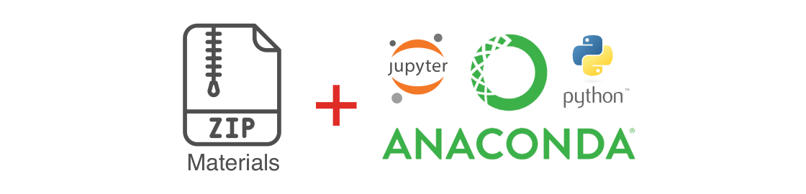

::: {.callout-note}

  **Your professional conduct is greatly appreciated. Out of respect to your fellow workshop attendees and instructors, please arrive at your workshop on time, having pre-installed all necessary software and materials. This will likely take 15-20 minutes.**

:::

Before starting any of our Python workshops, it is necessary to complete 3 tasks. Please make sure all of them are completed **before** you attend your workshop, as, depending on your internet speed, they may take a long time.

1. download and unzip **class materials**
2. download and install **Positron**
3. download and install **uv**, which then installs Python and the workshop's packages



## Troubleshooting session

We will hold a troubleshooting session to help with setup during the 20 minutes prior to the start of the workshop. 
**If you are unable to complete all three tasks by yourself, please join us at the workshop location for this session.**
Once the workshop starts we will **NOT** be able to give you one-to-one assistance with troubleshooting installation problems. Likewise, if you arrive late, please do **NOT** expect one-to-one assistance for anything covered at the beginning of the workshop.

## Materials

Download class materials for your workshop:

* Python Introduction: <https://github.com/IQSS/dss-workshops/releases/latest/download/materials-python-intro.zip>
* Python Webscraping: <https://github.com/IQSS/dss-workshops/releases/latest/download/materials-python-webscrape.zip>

Extract materials from the zipped directory (Right-click => Extract All on Windows, double-click on Mac) and move them to your desktop.

It will be useful when you view the above materials for you to see the different file extensions on your computer. Here are instructions for enabling this:

* [macOS](https://support.apple.com/guide/mac-help/show-or-hide-filename-extensions-on-mac-mchlp2304/mac)
* [Windows](https://support.microsoft.com/en-us/windows/common-file-name-extensions-in-windows-da4a4430-8e76-89c5-59f7-1cdbbc75cb01)

## Software

We write and run Python in [Positron](https://positron.posit.co/), a free data science IDE from Posit (our R workshops use it too), and we let [uv](https://docs.astral.sh/uv/) install Python itself and the packages each workshop needs, so that everyone has the same setup. The versions these materials were last tested with:

* Positron version ****
* uv version ****, installing Python ****

### Positron

Download and run the installer for your system from [positron.posit.co/download](https://positron.posit.co/download).

### uv

* **macOS and Linux:** open the Terminal application, paste this line, and press enter; then close and reopen the Terminal.

  ```sh
  curl -LsSf https://astral.sh/uv/install.sh | sh
  ```

* **Windows:** open PowerShell, paste this line, and press enter; then close and reopen PowerShell.

  ```powershell
  powershell -ExecutionPolicy ByPass -c "irm https://astral.sh/uv/install.ps1 | iex"
  ```

Check it with `uv --version`, which should print a version number.

### Python and the packages

uv installs these per workshop, from the materials folder, so nothing you do here affects other Python projects on your computer:

1. Start Positron and go to `File -> Open Folder`; choose the workshop materials folder you unzipped (for the introduction, `python-intro`).
2. Open a terminal inside Positron (`Terminal -> New Terminal`) and run:

   ```sh
   uv sync
   ```

   This installs Python  if you do not have it, and the packages listed in the folder's `pyproject.toml`, into a `.venv` folder inside the materials folder (`python-intro/.venv`). It takes a minute or two the first time.

::: {.callout-tip}

**Success? The interpreter shown at the top right of Positron's window should be the Python from `.venv` (click it and choose that one if not). Open the file with the word "BLANK" in its name and run its first cell with `Shift+Enter`: if a number or some text appears under the cell, you are ready.**

:::

::: {.callout-important}

**If you are having any difficulties with the installation, please stop by the training room 20 minutes prior to the start of the workshop.**

:::

## Notebooks in Positron

We run the workshop code in Jupyter notebooks (`.ipynb` files): documents that combine text, code, and the code's output. Positron opens them directly in its notebook editor; there is nothing else to install.

1. In the Explorer on the left, click a notebook (the one with `BLANK` in its name is the one to type along in).
2. The kernel picker at the top right should show the Python from `.venv`; choose it if it does not.
3. A notebook is a list of *cells*. To execute a cell, select it and press `Shift+Enter`; to add one, use the `+ Code` or `+ Markdown` button.

## Resources

* IQSS 
    + Training materials: <https://iqss.github.io/dss-training/>
    + Data Science Services: <https://www.iq.harvard.edu/data-science-services>
    + Research Computing Environment: <https://iqss.github.io/dss-rce/>

    
