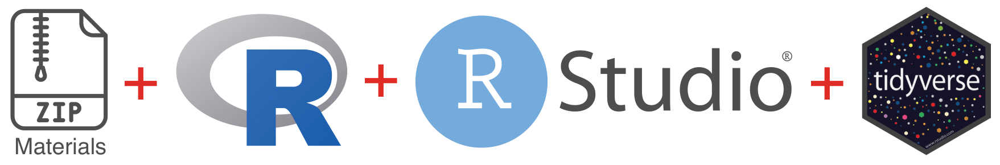
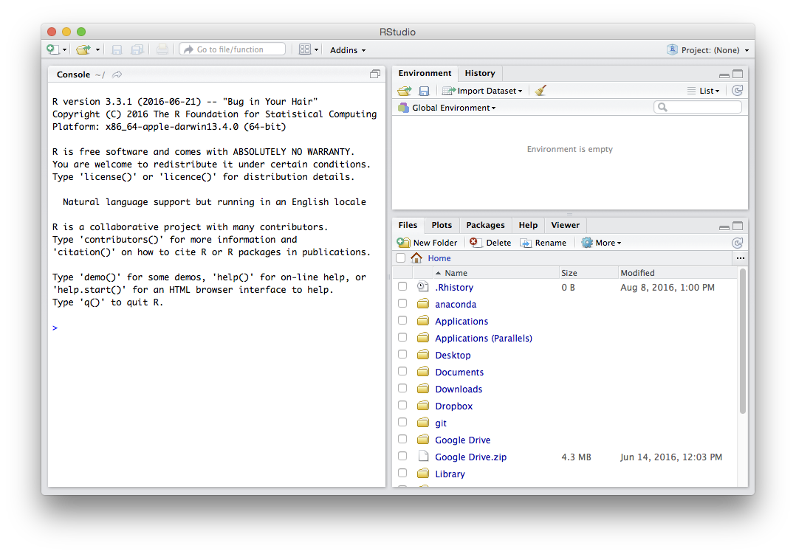
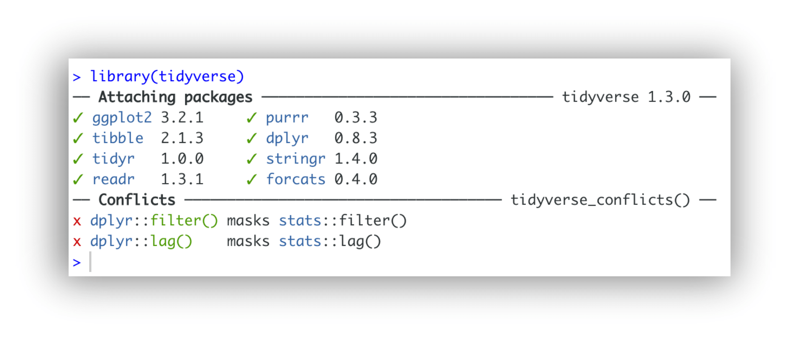

::: {.callout-note}

  **Your professional conduct is greatly appreciated. Out of respect to your fellow workshop attendees and instructors, please arrive at your workshop on time, having pre-installed all necessary software and materials. This will likely take 15-20 minutes.**

:::

Before starting any of our R workshops, it is necessary to complete 4 tasks. Please make sure all these tasks are completed **before** you attend your workshop, as, depending on your internet speed, they may take a long time. 

1. download and unzip **class materials**
2. download and install **R**
3. download and install **RStudio**
4. install the `tidyverse` suite of **R packages**

## Troubleshooting session

We will hold a troubleshooting session to help with setup during the 20 minutes prior to the start of the workshop. 
**If you are unable to complete all four tasks by yourself, please join us at the workshop location for this session.**
Once the workshop starts we will **NOT** be able to give you one-to-one assistance with troubleshooting installation problems. Likewise, if you arrive late, please do **NOT** expect one-to-one assistance for anything covered at the beginning of the workshop.

## Materials

Download class materials for your workshop:

* R Introduction: <https://github.com/IQSS/dss-workshops/releases/latest/download/materials-r-intro.zip>
* R Regression Models: <https://github.com/IQSS/dss-workshops/releases/latest/download/materials-r-models.zip>
* R Graphics: <https://github.com/IQSS/dss-workshops/releases/latest/download/materials-r-graphics.zip>
* R Data Wrangling: <https://github.com/IQSS/dss-workshops/releases/latest/download/materials-r-wrangling.zip>

Extract materials from the zipped directory (Right-click -> Extract All on Windows, double-click on Mac) and move them to your desktop. 

It will be useful when you view the above materials for you to see the different file extensions on your computer. Here are instructions for enabling this:

* [macOS](https://support.apple.com/guide/mac-help/show-or-hide-filename-extensions-on-mac-mchlp2304/mac)
* [Windows](https://support.microsoft.com/en-us/windows/common-file-name-extensions-in-windows-da4a4430-8e76-89c5-59f7-1cdbbc75cb01)

## Software

You must install **both R and RStudio**; it is essential that you have these pre-installed so that we can start the workshop on time. It is also important that you have the **latest versions** of each software, which currently are:

* R version ****
* RStudio version ****

**macOS:** 

1. Install R by downloading and running the .pkg file for your Mac (Apple silicon or Intel) from [CRAN](https://cran.r-project.org/bin/macosx/). 
2. Install the RStudio Desktop IDE by downloading and running the macOS installer from [Posit](https://posit.co/download/rstudio-desktop/).

**Windows:** 

1. Install R by downloading and running the .exe installer from [CRAN](https://cran.r-project.org/bin/windows/base/).
2. Install the RStudio Desktop IDE by downloading and running the Windows installer from [Posit](https://posit.co/download/rstudio-desktop/).

**Linux:** 

1. Install R by downloading the binary files for your distribution from [CRAN](https://cran.r-project.org/bin/linux/). Or you can use your package manager (e.g., for Debian/Ubuntu run `sudo apt-get install r-base` and for Fedora run `sudo yum install R`).
2. Install the RStudio Desktop IDE [for your distribution](https://posit.co/download/rstudio-desktop/).

::: {.callout-tip}

**Success? After both installations, please launch RStudio. If you were successful with the installations, you should see a window similar to this (note that the R version reported may be newer):**

:::

 
::: {.callout-important}

**If you are having any difficulties with the installations or your RStudio screen does not look like this one, please stop by the training room 20 minutes prior to the start of the workshop.**

:::

## Installing the `tidyverse`

We will use the `tidyverse` suite of packages throughout these R workshops.
Here are the steps for installation:

1.  **Launch an R session within RStudio**

    On Windows, click the start button and search for RStudio then click on it. On Mac,
    RStudio will be in your applications folder --- double click on it.

2.  **Install `tidyverse`**

    In the left-hand side window (called the `console`), at the command prompt (`>`) type the following and press enter:

    `install.packages("tidyverse")`

    *  If a choice appears that says something like: 
    
       `Do you want to install from sources the package which needs compilation?` 
    
       type `No` in the console.
    
    *  If you are running Windows OS, you may see a message that says: 
    
       `WARNING: Rtools is required to build R packages, but is not currently installed.`
    
       You can safely ignore this warning.

    A number of messages will scroll by, and there will be a long minute or two
    pause where nothing appears to happen (but the installation is actually occurring).
    At last, the output parade should end with a message like:

    `The downloaded source/binary packages are in....`

3.  **Check that installation was successful**

    We can check that `tidyverse` has installed correctly by connecting it to our current R session. 
    Type the following in the console at the command prompt (`>`) and press enter:

    `library(tidyverse)`

    ::: {.callout-tip}

    **Success? If so, you should see the following message in the console (note that the version numbers reported may be newer):**

    :::

    

    ::: {.callout-important}

    **If you do not see this message and encounter an error --- try troubleshooting this in the next section.**

    :::

### Troubleshooting `tidyverse` installation

Sometimes, you may run into problems installing the `tidyverse` suite of packages. Here are some commonly encountered errors and suggestions for how to fix them:

1.  **`tidyverse` is not available for R version...**
    * Solution: make sure you have the latest versions of both R () and RStudio ().

2.  **there is no package `rlang`...**
    * Solution: run this command in the console at the command prompt (`>`):
    * `install.packages("dplyr")` 
    * If a choice appears that says something  like `Do you want to install from sources the package which needs compilation?`, type `No` in the console.

3.  **there is no package `broom`...** 
    * Solution: run these commands in the console at the command prompt (`>`), **in this order**:
    * `install.packages("backports")`
    * `install.packages("zeallot")`
    * `install.packages("broom")`
    * `install.packages("tidyverse")`
    * If a choice appears at any point that says something like `Do you want to install from sources the package which needs compilation?`, type `No` in the console.

4.  **rlang and/or broom still do not work**
    * Solution: load individual packages that we need from the `tidyverse` suite, by running the following commands in the console at the command prompt (`>`):
    * `library("dplyr")`    for the pipe function `%>%` and other SQL commands
    * `library("ggplot2")`  modern data visualization
    * `library("readr")`    to load CSV data files
    * `library("tidyr")`    to reshape data frames

::: {.callout-important}

**If you have still not successfully installed `tidyverse` (or at least `dplyr`, `ggplot2`, `readr`, and `tidyr`) after troubleshooting, please stop by the training room 20 minutes before the start of your workshop so we can help you. Without these packages, you will not be able to follow along with the workshop materials.**

:::

## Installing `rmarkdown` (optional)

We can also install the `rmarkdown` package, which will allow us to
combine our text and code into a formatted document at the end of
the workshops. Installing this package is optional and will not affect
your ability to follow along with the workshop.

1.  **Install `rmarkdown`**

    At the command prompt in the console (`>`), please run the following command and press enter:

    `install.packages("rmarkdown")`

    then wait for the stream of messages to end with:

    `The downloaded source/binary packages are in....`

2.  **Check that installation was successful**

    We can check that `rmarkdown` has installed correctly by connecting it to our R session.
    Type the following in the console at the command prompt (`>`) and press enter:

    `library(rmarkdown)`

    ::: {.callout-tip}

    **Success? If so, in the console you should see just a command prompt (`>`) with no messages to the right of it.**

    :::

    ::: {.callout-important}

    **If you see error or warning messages after the command prompt, the installation was not successful.**

    :::

If all the above steps have been completed successfully, you should now
be ready to start your workshop. **If you ran into any problems, please
stop by the training room 20 minutes before the start of your workshop.**

## Resources

* IQSS 
    + Training materials: <https://iqss.github.io/dss-training/>
    + Data Science Services: <https://www.iq.harvard.edu/data-science-services>
    + Research Computing Environment: <https://iqss.github.io/dss-rce/>

* HBS
    + Research Computing Services: <https://www.hbs.edu/research-computing-services/>
    + RCS consulting email: <mailto:research@hbs.edu>

