```{r}
#| include: false
#| eval: true
library(Statamarkdown)  # registers the stata engine; chunks do not run (eval: false above)
```

**Topics**

* Univariate graphs
* Bivariate graphs

## Setup

### Software and Materials

Follow the [Stata Installation](https://iqss.github.io/dss-workshops/stata/install.html) instructions and ensure that you can successfully start Stata.

### Class structure and organization

* Please feel free to ask questions at any point if they are relevant to the current topic (or if you are lost!)
* Collaboration is encouraged - please introduce yourself to your neighbors!
* If you are using a laptop, you will need to adjust file paths accordingly
* Make comments in your Do-file - save on flash drive or email to yourself

### Prerequisites

This is an intermediate-level Stata graphics workshop

* Assumes basic knowledge of Stata
* Not appropriate for people already well familiar with graphing in Stata
* If you are catching on before the rest of the class, experiment with command features described in help files

### Goals

::: {.callout-tip}

**We will learn about Stata graphics by practicing graphing using two real datasets.** In particular, our goals are to:

1. Plot basic graphs in Stata
2. Plot two-way graphs in Stata

:::

## Graphing in Stata

::: {.callout-note}

**GOAL: To get familiar with how to produce graphs in Stata.** In particular:

1. Learn about graphing strategies
2. Compare two examples of a bad graph and a good graph

:::

### Graphing strategies

* Keep it simple
* Labels, labels, labels!!
* Avoid cluttered graphs
* Every part of the graph should be meaningful
* Avoid:
    + Shading
    + Distracting colors
    + Decoration
* Always know what you are working with before you get started
    + Recognize scale of data
    + If you are using multiple variables, how do their scales align?
* Before any graphing procedure review variables with `codebook`, `sum`, `tab`, etc.
* HELPFUL STATA HINT: If you want your command to go on multiple lines use `///` at end of each line

### Terrible graph
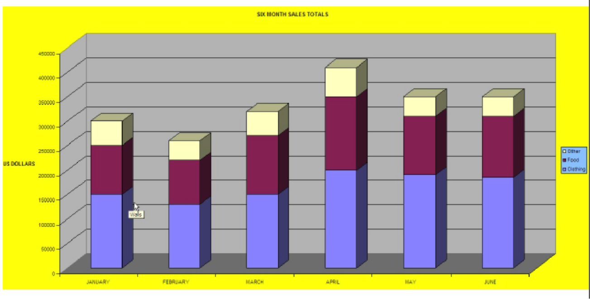

### Much better graph

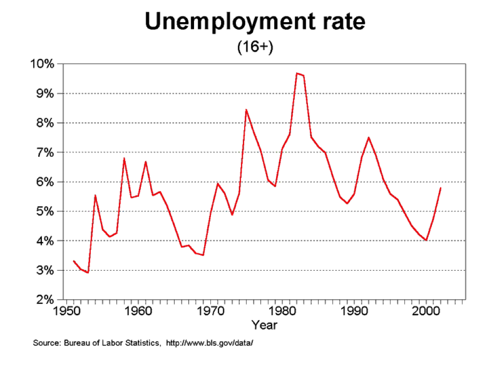

## Univariate graphics

::: {.callout-note}

**GOAL: To learn how to graph a single continuous and categorical variable.** In particular:

1. Graph a continuous variable using a histogram
2. Graph a categorical variable using a bar graph

:::

### Our first dataset

* Time Magazine Public School Poll
    + Based on survey of 1,000 adults in U.S.
    + Conducted in August 2010
    + Questions regarding feelings about parental involvement, teachers union, current potential for reform
* Open Stata and call up the datafile for today

```{stata}
// Step 1: tell Stata where to find data:

// Step 2: call up our dataset:

```

### Single continuous variable

**Example: Histogram**

* Stata assumes you are working with continuous data
* Very simple syntax:
    + `hist varname`
* Put a comma after your varname and start adding options
    + `bin(#)` : change the number of bars that the graph displays
    + `normal` : overlay normal curve
    + `addlabels` : add actual values to bars

**Histogram options**

* To change the numeric depiction of your data add these options after the comma
    + Choose one: `density`, `fraction`, `frequency`, `percent`
* Be sure to properly describe your histogram:
    + `title("insert name of graph")`
    + `subtitle("insert subtitle of graph")`
    + `note("insert note to appear at bottom of graph")`
    + `caption("insert caption to appear below notes")`

**Histogram example**

```{stata}
///

```
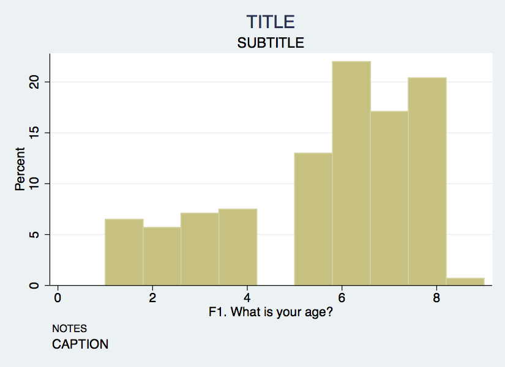

**Axis titles & labels**

* Axis title options (default is variable label):
    + `xtitle("insert x axis name")`
    + `ytitle("insert y axis name")`
* Don't want axis titles?
    + `xtitle("")`
    + `ytitle("")`
* Add labels to X or Y axis:
    + `xlabel("insert x axis label")`
    + `ylabel("insert y axis label")`
* Tell Stata how to scale each axis
    + `xlabel(#(#)#)` --- start, increment, end
    + `xlabel(0(5)100)` This would label x-axis from 0-100 in increments of 5

**Axis labels example**

```{stata}
///
///

```

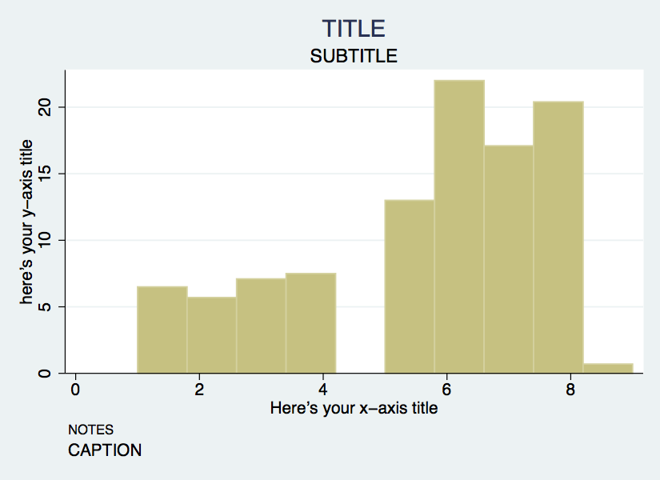

### Single categorical variable

* We can also use the `hist` command for bar graphs
    + Simply specify the option `discrete`
* Stata will produce one bar for each level (i.e. category) of variable
* Use `xlabel` command to insert names of individual categories

```{stata}
///
///

```

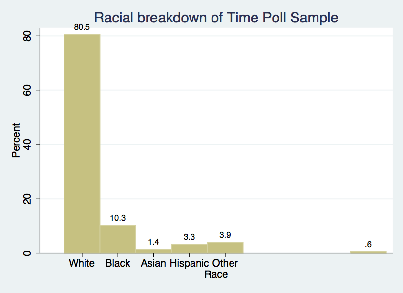

### Exercise 0

**Histograms & bar graphs**

1.  Open the datafile, `NatNeighCrimeStudy.dta`.

```{stata}

```

2.  Create a histogram of the tract-level poverty rate (`T_POVRTY`).

```{stata}

```

3.  Insert the normal curve over the histogram.

```{stata}

```

4.  Change the numeric representation on the Y-axis to `percent`.

```{stata}

```

5.  Add appropriate titles to the overall graph and the x axis and y axis. Also, add a note that states the source of this data.

```{stata}

```

6.  Open the datafile, `TimePollPubSchools.dta`.

```{stata}

```

7.  Create a histogram of the question, "What grade would you give your child's school" (`Q11`). Be sure to tell Stata that this is a categorical variable.

```{stata}

```

8.  Format this graph so that the axes have proper titles and labels. Also, add an appropriate title to the overall graph. Add a note stating the source of the data.

```{stata}

```

## Bivariate graphics

::: {.callout-note}

**GOAL: To learn how to produce two-way bivariate graphs.** In particular, to learn:

1. The `twoway` command
2. The `twoway` `title` options
3. The `twoway` `symbol` options
4. How to overlay `twoway` graphs

:::

### Next dataset

* National Neighborhood Crime Study (NNCS)
    + N=9593 census tracts in 2000
    + Explore sources of variation in crime for communities in the United States
    + Tract-level data: crime, social disorganization, disadvantage, socioeconomic inequality
    + City-level data: labor market, socioeconomic inequality, population change

### The `twoway` family

* `twoway` is basic Stata command for all two-way graphs
* Use `twoway` anytime you want to make comparisons among variables
* Can be used to combine graphs (i.e., overlay one graph with another)
    + e.g., insert line of best fit over a scatter plot
* Some basic examples:

```{stata}

```

**Twoway & the `by` statement**

```{stata}

```

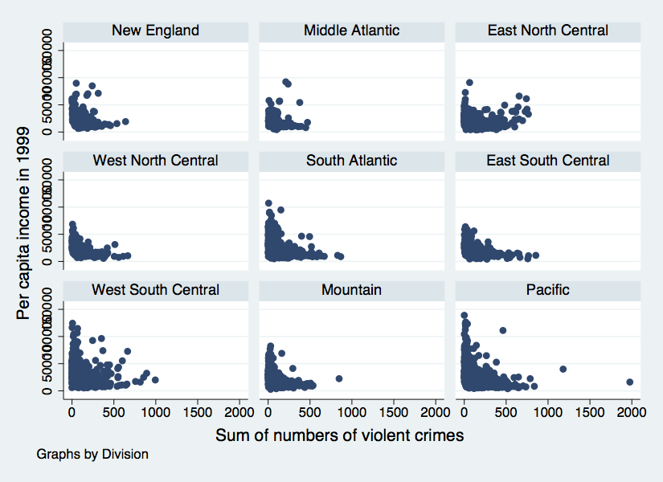

**Twoway title options**

* Same title options as with histogram
    + `title("insert name of graph")`
    + `subtitle("insert subtitle of graph")`
    + `note("insert note to appear at bottom of graph")`
    + `caption("insert caption to appear below notes")`

**Twoway title options example**

```{stata}
///
///
///
///

```

**Twoway symbol options**

* A variety of symbol shapes are available: use `palette symbolpalette` to see them and `msymbol()` to set them

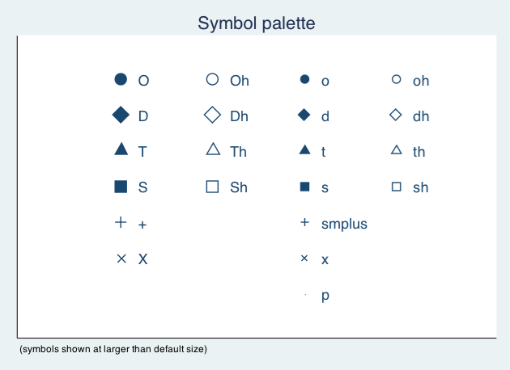

**Twoway symbol options example**

```{stata}
///
///
///
///
///

```

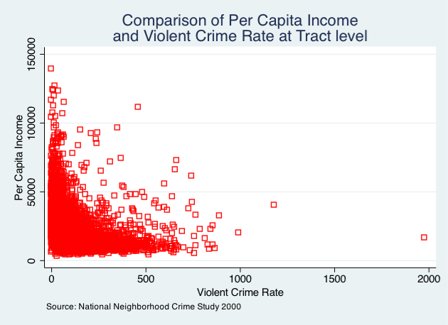

### Overlaying twoway graphs

* Very simple to combine multiple graphs by just putting each graph command in parentheses
    + `twoway (scatter var1 var2) (lfit var1 var2)`
* Add individual options to each graph within the parentheses
* Add overall graph options as usual following the comma
    + `twoway (scatter var1 var2) (lfit var1 var2), options`

**Overlaying points & lines**

```{stata}
///
///
///
///
///

```

**Overlaying points & labels**

```{stata}
///
///
///
///
///

```

### Twoway line graphs

* Line graphs helpful for a variety of data
    + Especially any type of time series data
* We will use data on US life expectancy from 1900-1999
    + `webuse uslifeexp, clear`

```{stata}

///

```

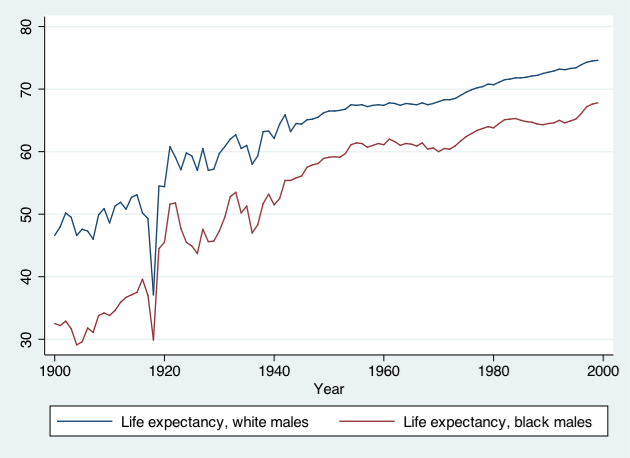

```{stata}
///

```

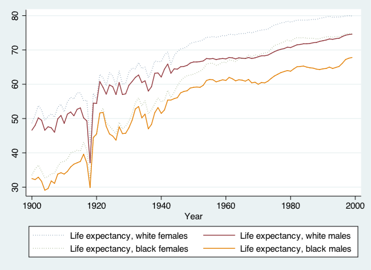

### Stata graphing lines

```{stata}

```

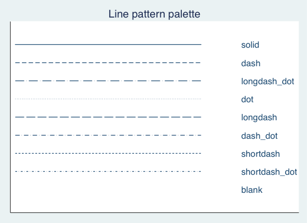

### Exercise 1

**The `twoway` family**

1. Open the datafile, `NatNeighCrimeStudy.dta`.

```{stata}

```

2.  Create a basic twoway scatterplot that compares the city unemployment rate (`C_UNEMP`) to the percent secondary sector low-wage jobs (`C_SSLOW`).

```{stata}

```

3.  Generate the same scatterplot, but this time, divide the plot by the dummy variable indicating whether the city is located in the south or not (`C_SOUTH`).

```{stata}

```

4.  Change the color of the symbol that you use in this scatter plot.

```{stata}

```

5.  Change the type of symbol you use to a marker of your choice.

```{stata}

```

6.  Notice in your scatterplot that is broken down by `C_SOUTH` that there is an outlier in the upper right hand corner of the "Not South" graph. Add the city name label to this marker.

```{stata}

```

## Exporting graphs

::: {.callout-note}

**GOAL: To learn how to export graphs in Stata.**

:::

* From Stata, right click on the image and select "Save as...", or use the `graph export` command, which takes the format from the file extension:
    + `graph export myfig.pdf, replace` --- vector, best for print and for LaTeX
    + `graph export myfig.png, width(2000) replace` --- raster, best for the web and for slides; set `width()` explicitly or you get a small image
    + `graph export myfig.svg, replace` --- vector, for the web
* To place a graph in a document, insert the exported file rather than pasting the image, so that re-exporting the graph updates the document.

## Wrap-up

### Feedback

These workshops are a work in progress. Suggestions and feedback are welcome: use the Request help button at the top of the page.

